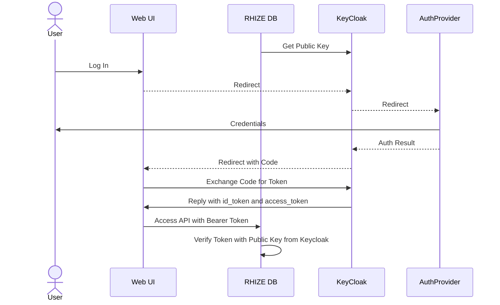

Rhize uses [OpenIDConnect](https://openid.net/developers/how-connect-works/) to connect to a [Keycloak](https://www.keycloak.org/) server to authenticate users and manage Role-based access controls.

Open ID Connect is a security architecture that uses JSON Web Tokens (JWTs) to access secured resources.
JWT are issued by KeyCloak, and the users can be managed in KeyCloak, or managed in other services like LDAP, Google, Azure AD, Facebook, etc.

When a user accesses the user interface, the UI redirects to Keycloak.
Depending on how it is configured, Keycloak redirects to the authentication provider so that the user can log in. If the user is successfully authenticated, Keycloak redirects back to the user interface with an authentication code in the URL parameters.
The UI then calls a secure API to exchange the authentication code for a JWT.

The UI then uses that JWT to access secured API like the RHIZE GraphQL API.

The RHIZE DB has the public key from Keycloak, which can be used to verify the JWT.

