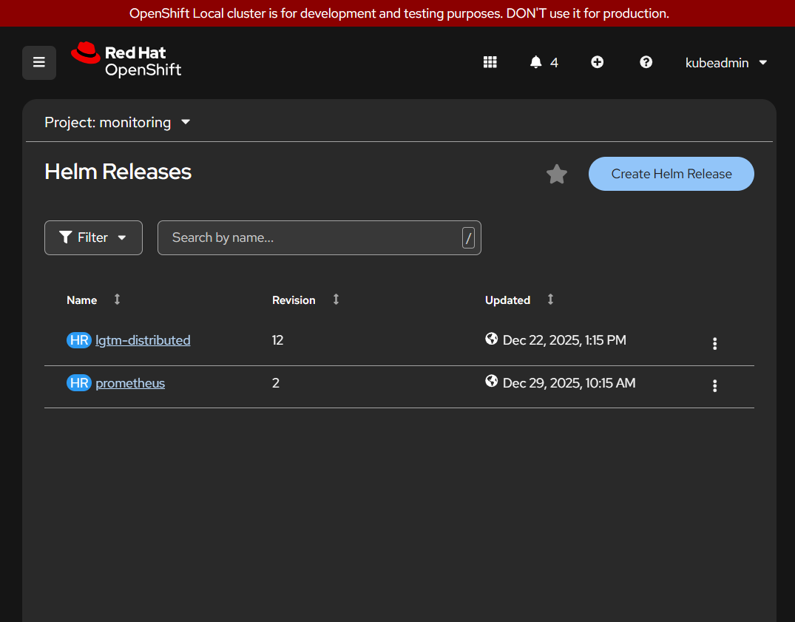

This procedure will guide you through the installation of Rhize, including monitoring applications on the Red Hat OpenShift platform v4.x.x.

Prerequisites:

 - Red Hat OpenShift Platform running
 - kubeadmin permissions to 
    - create/list namespaces
    - create/list cluster Helm chart repositories
    - create secret in `openshift-config` namespace
    - create release
 - Your cluster has access to public Helm chart repositories
 - OpenShift CLI `oc` available

## 1. Create the OpenShift Projects

With the Red Hat OpenShift Console:
1. Login using your existing credentials.
1. Using the left hand menu, navigate to _Home_ and _Projects_.
1. Click _Create Project_ and create the following projects:
   - rhize
   - monitoring
   - cnpg-operator
1. Click _Create_ for each project.

> The 'rhize', 'monitoring', and 'cloudnative-pg-operator' projects have now been created

1. Using the left hand menu, navigate to _Helm_ and _Releases_.
1. Using the project selector, click the down arrow and ensure 'rhize' is selected.

## 2. Configure Helm Chart Repositories

{}

### Add Libre Helm Chart Secret

The Libre Helm chart repository requires authentication to access. Create a secret using the Red Hat OpenShift command line utility using your provided access token.

```shell
$ oc create secret generic libre-helmchart-repository --from-literal=username='tom561' --from-literal=password='glpat-XXXXX' --namespace openshift-config
```

Now that the secret is configured, we can use it in the next step to create the Helm chart repositories.

### Add Helm Chart Repositories

With the Red Hat OpenShift Console:
1. Login using your existing credentials.
1. Using the left hand menu, navigate to _Helm_ and _Repositories_.
1. Click _Create Helm Repository_ and create the following Helm Chart Repositories (HCR).

| Type           | name                 | label                | url                                                              |
| :------------- | :------------------- | :------------------- | :--------------------------------------------------------------- |
| Cluster Scoped | appsmith-ee          | appsmith-ee          | https://helm-ee.appsmith.com                                     |
| Cluster Scoped | cloudnative-pg       | cloudnative-pg       | https://cloudnative-pg.github.io/charts                          |
| Cluster Scoped | codecentric          | codecentric          | https://codecentric.github.io/helm-charts                        |
| Cluster Scoped | grafana              | grafana              | https://grafana.github.io/helm-charts                            |
| Cluster Scoped | libre                | libre                | https://gitlab.com/api/v4/projects/42214456/packages/helm/stable |
| Cluster Scoped | prometheus-community | prometheus-community | https://prometheus-community.github.io/helm-charts               |
| Cluster Scoped | questdb              | questdb              | https://helm.questdb.io                                          |
| Cluster Scoped | redpanda             | redpanda             | https://charts.redpanda.com                                      |

Example configured helm repositories:


{}

## 3. Install CloudNativePG Postgres Operator

{}

### Install the CloudNativePG Operator

1. Using the left hand menu, navigate to _Helm_ and _Releases_.
1. Using the project selector, click the down arrow and ensure 'cloudnative-pg-operator' is selected.
1. Click _Create Helm Release_
1. Using the filter, select _Chart Repository_: 'cloudnative-pg'
1. In the search filter for 'cloudnative-pg'
1. Click the 'cloudnative-pg' helm chart
1. Click the _Create_ button
1. Click the _Chart Version_ dropdown and wait for it to finish loading
1. Select the latest version
1. Make any environmental specific changes in the _YAML view_, using the Values.yaml below
   ```YAML {filename="Values.yaml",linenos=table}
   config:
     clusterWide: true
     create: true
   containerSecurityContext: null
   crds:
     create: true
   image:
     pullPolicy: IfNotPresent
     repository: ghcr.io/cloudnative-pg/cloudnative-pg
     tag: ''
   monitoring:
     grafanaDashboard:
        configMapName: cnpg-grafana-dashboard
        create: true
        namespace: monitoring
   podSecurityContext: null
   rbac:
     aggregateClusterRoles: false
     create: true
   replicaCount: 1
   serviceAccount:
     create: true
     name: ''
   ```
{}

## 4. Install Monitoring Applications

| Rhize recommends a separate namespace for monitoring¹

{}

### Install prometheus
1. Using the left hand menu, navigate to _Helm_ and _Releases_.
1. Using the project selector, click the down arrow and ensure 'monitoring' is selected.
1. Click _Create Helm Release_
1. Using the filter, select _Chart Repository_: 'prometheus-community'
1. In the search filter for 'prometheus'
1. Click the 'prometheus' helm chart
1. Click the _Create_ button
1. Click the _Chart Version_ dropdown and wait for it to finish loading
1. Select version '27.52.0 / App Version v3.8.1 (Provided by Prometheus Community)' from the drop down.
1. Make any environmental specific changes in the _YAML view_, including changing the replicas to 2  
   ```YAML {filename="Values.yaml",linenos=table}
   alertmanager:
     enabled: true
     persistence:
       enabled: true
       size: 2Gi
     podSecurityContext: null
     securityContext: null
   imagePullSecrets: []
   kube-state-metrics:
     enabled: false
   networkPolicy:
     enabled: false
   prometheus-node-exporter:
     enabled: false
   prometheus-pushgateway:
     enabled: false
   rbac:
     create: true
   server:
     containerSecurityContext: null
     image:
       pullPolicy: IfNotPresent
       repository: quay.io/prometheus/prometheus
     name: server
     persistentVolume:
       enabled: true
       size: 8Gi
     securityContext: null
   ```
1. Click the _Create_ button

> Prometheus has now been installed

### Install lgtm-distributed
1. Using the left hand menu, navigate to _Helm_ and _Releases_.
1. Using the project selector, click the down arrow and ensure 'monitoring' is selected.
1. Click _Create Helm Release_
1. Using the filter, select _Chart Repository_: 'grafana'
1. In the search filter for 'lgtm distributed'
1. Click the 'LGTM Distributed' helm chart
1. Click the _Create_ button
1. Click the _Chart Version_ dropdown and wait for it to finish loading
1. Select version '0.80.6' from the drop down.
1. Make any environmental specific changes in the _YAML view_.  Replace `grafana.<openshift-domain>` (highlighted in the file below)  
{}

```YAML {filename="Values.yaml",linenos=table,hl_lines=[43]}
grafana:
  datasources:
    datasources.yaml:
      apiVersion: 1
      datasources:
        - isDefault: false
          name: Loki
          type: loki
          uid: loki
          url: 'http://{{ .Release.Name }}-loki-gateway'
        - isDefault: true
          name: Mimir
          type: prometheus
          uid: prom
          url: 'http://{{ .Release.Name }}-mimir-nginx/prometheus'
        - isDefault: false
          jsonData:
            lokiSearch:
              datasourceUid: loki
            serviceMap:
              datasourceUid: prom
            tracesToLogsV2:
              datasourceUid: loki
            tracesToMetrics:
              datasourceUid: prom
          name: Tempo
          type: tempo
          uid: tempo
          url: 'http://{{ .Release.Name }}-tempo-query-frontend:3200'
        - name: Prometheus
          type: prometheus
          url: http://prometheus-server
          access: proxy
          isDefault: true
  enabled: true
  extraObjects:
    - apiVersion: route.openshift.io/v1
      kind: Route
      metadata:
        name: grafana
        namespace: monitoring
      spec:
        host: grafana.<openshift-domain>
        port:
          targetPort: service
        tls:
          insecureEdgeTerminationPolicy: Redirect
          termination: edge
        to:
          kind: Service
          name: lgtm-distributed-grafana
          weight: 100
        wildcardPolicy: None
  securityContext: null
grafana-oncall:
  enabled: false
loki:
  enabled: true
  gateway:
    podSecurityContext: null
  loki:
    podSecurityContext: null
  memcached:
    podSecurityContext: null
mimir:
  enabled: false
tempo:
  containerSecurityContext: null
  enabled: true
  ingester:
    replicas: 1
  securityContext: null
  tempo:
    podSecurityContext: null
    securityContext: null
  tokengenJob:
    containerSecurityContext: null
```

{}
1. Click the _Create_ button

> Loki, Grafana, and Tempo have now been installed

{}

Example running releases in the 'monitoring' namespace:


## 5. Install and configure Keycloak

### 5.1 Install Postgres for Keycloak

1. Using the left hand menu, navigate to _Helm_ and _Releases_.
1. Using the project selector, click the down arrow and ensure 'keycloak' is selected (create the project if it doesn't exist).
1. Click _Create Helm Release_
1. Using the filter, select _Chart Repository_: 'cloudnative-pg'
1. In the search filter for 'cluster'
1. Click the 'cluster' helm chart
1. Click the _Create_ button
1. Click the _Chart Version_ dropdown and wait for it to finish loading
1. Select the latest version
1. Make any environmental specific changes in the _YAML view_, using the Values.yaml below

```YAML {filename="Values.yaml",linenos=table}
backups:
  enabled: false
cluster:
  initdb:
    database: keycloak
    owner: keycloak
  instances: 3
  logLevel: info
  monitoring:
    enabled: false
  postgresGID: -1
  postgresUID: -1
  storage:
    size: 8Gi
    storageClass: ''
databases: []
imageCatalog:
  create: true
  images: []
mode: standalone
nameOverride: keycloak-cnpg-cluster
replica: null
type: postgresql
version:
  postgis: '3.4'
  postgresql: '16'
  timescaledb: '2.15'
```

1. Click the _Create_ button

> The Keycloak Postgres cluster has now been installed

### 5.2 Install KeycloakX
<todo>

#### 5.2.1 Keycloak Configuration
<todo>

## 6. Install Rhize Applications
<todo>

### 6.1 Install Redpanda, including Redpanda Console <todo>
<todo>

### 6.2 Install QuestDB
<todo>

### 6.3 Install Restate
<todo>

### 6.4 Install AppSmith-EE
<todo>

### 6.5 Install Rhize Typescript Host Service
<todo>

### 6.6 Install Rhize BaaS
<todo>

### 6.7 Install Rhize ISA-95
<todo>

### 6.8 Install Rhize Workflow
<todo>

### 6.9 Install Rhize Admin UI
<todo>

### 6.10 Install Rhize Audit (Optional)
<todo>

### 6.11 Install Postgres (High Availability) for Rhize Audit
<todo>

# Footnotes 

¹ - The 'monitoring' namespace is optional. The monitoring applications can be installed into the same namespace however these applications are typically used by other deployments and namespaces. Separating them into their own allows for better control and centralization of application services.