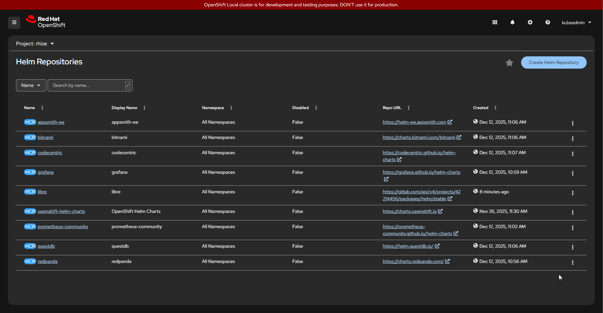

This procedure will guide you through the installation of Rhize, including monitoring applications on the Red Hat OpenShift platform v4.x.x.

Prerequisites:

 - Red Hat OpenShift Platform running
 - kubeadmin permissions to 
    - create/list namespaces
    - create/list cluster Helm chart repositories
    - create secret in `openshift-config` namespace
    - create release
 - Your cluster has access to public Helm chart repositories
 - OpenShift CLI `oc` available

## 1. Create the Rhize OpenShift Project

With the Red Hat OpenShift Console:
1. Login using your existing credentials.
1. Using the left hand menu, navigate to _Home_ and _Projects_.
1. Click _Create Project_ and enter name 'rhize'
1. Click _Create_ 

> The 'rhize' project with the 'rhize' namespace has now been created

1. Using the left hand menu, navigate to _Helm_ and _Releases_.
1. Using the project selector, click the down arrow and ensure 'rhize' is selected.

## 2. Configure Helm Chart Repositories

{}

### Add Libre Helm Chart Secret

The Libre Helm chart repository requires authentication to access. Create a secret using the Red Hat OpenShift command line utility using your provided access token.

```shell
$ oc create secret generic libre-helmchart-repository --from-literal=username='tom561' --from-literal=password='glpat-XXXXX' --namespace openshift-config
```

Now that the secret is configured, we can use it in the next step to create the Helm chart repositories.

### Add Helm Chart Repositories

With the Red Hat OpenShift Console:
1. Login using your existing credentials.
1. Using the left hand menu, navigate to _Helm_ and _Repositories_.
1. Click _Create Helm Repository_ and create the following Helm Chart Repositories (HCR).

| Type           | name                 | label                | url                                                              |
| :------------- | :------------------- | :------------------- | :--------------------------------------------------------------- |
| Cluster Scoped | appsmith-ee          | appsmith-ee          | https://helm-ee.appsmith.com                                     |
| Cluster Scoped | bitnami              | bitnami              | https://charts.bitnami.com/bitnami                               |
| Cluster Scoped | codecentric          | codecentric          | https://codecentric.github.io/helm-charts                        |
| Cluster Scoped | grafana              | grafana              | https://grafana.github.io/helm-charts                            |
| Cluster Scoped | libre                | libre                | https://gitlab.com/api/v4/projects/42214456/packages/helm/stable |
| Cluster Scoped | prometheus-community | prometheus-community | https://prometheus-community.github.io/helm-charts               |
| Cluster Scoped | questdb              | questdb              | https://helm.questdb.io                                          |
| Cluster Scoped | redpanda             | redpanda             | https://charts.redpanda.com                                      |

Example configured helm repositories:


{}

## 3. Install Monitoring Applications

| Rhize recommends a separate namespace for monitoring¹

{}

### Prepare the monitoring namespace

With the Red Hat OpenShift Console:
1. Login using your existing credentials.
1. Using the left hand menu, navigate to _Administration_ and _Namespaces_.
1. Click _Create Namespace_ and enter name 'monitoring'
1. Click _Create_

> The monitoring namespace has now been created.

### Install lgtm-distributed
1. Using the left hand menu, navigate to _Helm_ and _Releases_.
1. Using the project selector, click the down arrow and ensure 'monitoring' is selected.
1. Click _Create Helm Release_
1. Using the filter, select _Chart Repository_: 'grafana'
1. In the search filter for 'lgtm distributed'
1. Click the 'LGTM Distributed' helm chart
1. Click the _Create_ button
1. Click the _Chart Version_ dropdown and wait for it to finish loading
1. Select version '0.80.6' from the drop down.
1. Make any environmental specific changes in the _YAML view_.  Replace `grafana.<openshift-domain>` (highlighted in the file below)  
{}

```YAML {filename="Values.yaml",linenos=table,hl_lines=[38]}
grafana:
  datasources:
    datasources.yaml:
      apiVersion: 1
      datasources:
        - isDefault: false
          name: Loki
          type: loki
          uid: loki
          url: 'http://{{ .Release.Name }}-loki-gateway'
        - isDefault: true
          name: Mimir
          type: prometheus
          uid: prom
          url: 'http://{{ .Release.Name }}-mimir-nginx/prometheus'
        - isDefault: false
          jsonData:
            lokiSearch:
              datasourceUid: loki
            serviceMap:
              datasourceUid: prom
            tracesToLogsV2:
              datasourceUid: loki
            tracesToMetrics:
              datasourceUid: prom
          name: Tempo
          type: tempo
          uid: tempo
          url: 'http://{{ .Release.Name }}-tempo-query-frontend:3200'
  enabled: true
  extraObjects:
    - apiVersion: route.openshift.io/v1
      kind: Route
      metadata:
        name: grafana
        namespace: monitoring
      spec:
        host: grafana.<openshift-domain>
        port:
          targetPort: service
        tls:
          insecureEdgeTerminationPolicy: Redirect
          termination: edge
        to:
          kind: Service
          name: lgtm-distributed-grafana
          weight: 100
        wildcardPolicy: None
  securityContext: null
grafana-oncall:
  enabled: false
loki:
  enabled: true
  gateway:
    nginxConfig:
      resolver: dns-default.openshift-dns.svc.cluster.local
    podSecurityContext: null
  loki:
    podSecurityContext: null
  memcached:
    podSecurityContext: null
mimir:
  alertmanager:
    resources:
      requests:
        cpu: 20m
  compactor:
    resources:
      requests:
        cpu: 20m
  distributor:
    resources:
      requests:
        cpu: 20m
  enabled: false
  ingester:
    replicas: 2
    resources:
      requests:
        cpu: 20m
    zoneAwareReplication:
      enabled: false
  minio:
    resources:
      requests:
        cpu: 20m
  overrides_exporter:
    resources:
      requests:
        cpu: 20m
  querier:
    replicas: 1
    resources:
      requests:
        cpu: 20m
  query_frontend:
    resources:
      requests:
        cpu: 20m
  query_scheduler:
    replicas: 1
    resources:
      requests:
        cpu: 20m
  rollout_operator:
    resources:
      requests:
        cpu: 20m
  ruler:
    resources:
      requests:
        cpu: 20m
  store_gateway:
    resources:
      requests:
        cpu: 20m
    zoneAwareReplication:
      enabled: false
tempo:
  containerSecurityContext: null
  enabled: true
  ingester:
    replicas: 1
  securityContext: null
  tempo:
    podSecurityContext: null
    securityContext: null
  tokengenJob:
    containerSecurityContext: null
```

{}
1. Click the _Create_ button

> Loki, Grafana, and Tempo have now been installed

### Install prometheus
1. Using the left hand menu, navigate to _Helm_ and _Releases_.
1. Using the project selector, click the down arrow and ensure 'monitoring' is selected.
1. Click _Create Helm Release_
1. Using the filter, select _Chart Repository_: 'prometheus-community'
1. In the search filter for 'prometheus'
1. Click the 'prometheus' helm chart
1. Click the _Create_ button
1. Click the _Chart Version_ dropdown and wait for it to finish loading
1. Select version '27.52.0 / App Version v3.8.1 (Provided by Prometheus Community)' from the drop down.
1. Make any environmental specific changes in the _YAML view_, including changing the replicas to 2  

{}

```YAML {filename="Values.yaml",linenos=table}
alertRelabelConfigs: {}
alertmanager:
  enabled: true
  persistence:
    accessModes:
      - ReadWriteOnce
    annotations: {}
    emptyDir: {}
    enabled: true
    labels: {}
    size: 2Gi
  podSecurityContext: null
  securityContext: null
commonMetaLabels: {}
configmapReload:
  env: []
  prometheus:
    containerPort: 8080
    containerPortName: metrics
    containerSecurityContext: null
    enabled: true
    extraArgs: {}
    extraConfigmapMounts: []
    extraVolumeDirs: []
    extraVolumeMounts: []
    image:
      digest: ''
      pullPolicy: IfNotPresent
      repository: quay.io/prometheus-operator/prometheus-config-reloader
      tag: v0.87.1
    livenessProbe:
      httpGet:
        path: /healthz
        port: metrics
        scheme: HTTP
      initialDelaySeconds: 2
      periodSeconds: 10
    name: configmap-reload
    readinessProbe:
      httpGet:
        path: /healthz
        port: metrics
        scheme: HTTP
      periodSeconds: 10
    resources: {}
    startupProbe:
      enabled: false
      httpGet:
        path: /healthz
        port: metrics
        scheme: HTTP
      periodSeconds: 10
  reloadUrl: ''
extraManifests: []
extraScrapeConfigs: ''
forceNamespace: ''
imagePullSecrets: []
kube-state-metrics:
  enabled: true
networkPolicy:
  enabled: false
prometheus-node-exporter:
  containerSecurityContext: null
  enabled: true
  rbac:
    pspEnabled: false
prometheus-pushgateway:
  enabled: true
  serviceAnnotations:
    prometheus.io/probe: pushgateway
rbac:
  create: true
ruleFiles: {}
scrapeConfigFiles: []
server:
  affinity: {}
  alertmanagers: []
  baseURL: ''
  clusterRoleNameOverride: ''
  command: []
  configFromSecret: ''
  configMapAnnotations: {}
  configMapOverrideName: ''
  configPath: /etc/config/prometheus.yml
  containerSecurityContext: null
  daemonSet:
    annotations: {}
    enabled: false
    labels: {}
  defaultFlagsOverride: []
  deploymentAnnotations: {}
  dnsConfig: {}
  dnsPolicy: ClusterFirst
  emptyDir:
    medium: ''
    sizeLimit: ''
  enableServiceLinks: true
  env: []
  exemplars: {}
  extraArgs: {}
  extraConfigmapLabels: {}
  extraConfigmapMounts: []
  extraFlags:
    - web.enable-lifecycle
  extraHostPathMounts: []
  extraInitContainers: []
  extraSecretMounts: []
  extraVolumeMounts: []
  extraVolumes: []
  fullnameOverride: ''
  global:
    evaluation_interval: 1m
    scrape_interval: 1m
    scrape_timeout: 10s
  hostAliases: []
  hostNetwork: false
  image:
    digest: ''
    pullPolicy: IfNotPresent
    repository: quay.io/prometheus/prometheus
    tag: ''
  ingress:
    annotations: {}
    enabled: false
    extraLabels: {}
    extraPaths: []
    hosts: []
    ingressClassName: ''
    path: /
    pathType: Prefix
    tls: []
  livenessProbeFailureThreshold: 3
  livenessProbeInitialDelay: 30
  livenessProbePeriodSeconds: 15
  livenessProbeSuccessThreshold: 1
  livenessProbeTimeout: 10
  name: server
  nodeSelector: {}
  otlp: {}
  persistentVolume:
    accessModes:
      - ReadWriteOnce
    annotations: {}
    enabled: true
    existingClaim: ''
    labels: {}
    mountPath: /data
    size: 8Gi
    statefulSetNameOverride: ''
    subPath: ''
  podAnnotations: {}
  podAntiAffinity: ''
  podAntiAffinityTopologyKey: kubernetes.io/hostname
  podDisruptionBudget:
    enabled: false
  podLabels: {}
  portName: ''
  prefixURL: ''
  priorityClassName: ''
  probeHeaders: []
  probeScheme: HTTP
  readinessProbeFailureThreshold: 3
  readinessProbeInitialDelay: 30
  readinessProbePeriodSeconds: 5
  readinessProbeSuccessThreshold: 1
  readinessProbeTimeout: 4
  releaseNamespace: false
  remoteRead: []
  remoteWrite: []
  replicaCount: 1
  resources: {}
  retention: 15d
  retentionSize: ''
  revisionHistoryLimit: 10
  route:
    main:
      additionalRules: []
      annotations: {}
      apiVersion: ''
      enabled: false
      filters: []
      hostnames: []
      httpsRedirect: false
      kind: ''
      labels: {}
      matches:
        - path:
            type: PathPrefix
            value: /
      parentRefs: []
  runtimeClassName: ''
  securityContext: null
  service:
    additionalPorts: []
    annotations: {}
    clusterIP: ''
    enabled: true
    externalIPs: []
    externalTrafficPolicy: ''
    gRPC:
      enabled: false
      servicePort: 10901
    labels: {}
    loadBalancerClass: ''
    loadBalancerIP: ''
    loadBalancerSourceRanges: []
    servicePort: 80
    sessionAffinity: None
    statefulsetReplica:
      enabled: false
      replica: 0
    type: ClusterIP
  sidecarContainers: {}
  sidecarTemplateValues: {}
  startupProbe:
    enabled: false
    failureThreshold: 30
    periodSeconds: 5
    timeoutSeconds: 10
  statefulSet:
    annotations: {}
    enabled: false
    headless:
      annotations: {}
      gRPC:
        enabled: false
        servicePort: 10901
      labels: {}
      servicePort: 80
    labels: {}
    podManagementPolicy: OrderedReady
    pvcDeleteOnStsDelete: false
    pvcDeleteOnStsScale: false
  storagePath: ''
  strategy:
    type: Recreate
  tcpSocketProbeEnabled: false
  terminationGracePeriodSeconds: 300
  tolerations: []
  topologySpreadConstraints: []
  tsdb: {}
  verticalAutoscaler:
    enabled: false
serverFiles:
  alerting_rules.yml: {}
  alerts: {}
  prometheus.yml:
    rule_files:
      - /etc/config/recording_rules.yml
      - /etc/config/alerting_rules.yml
      - /etc/config/rules
      - /etc/config/alerts
    scrape_configs:
      - job_name: prometheus
        static_configs:
          - targets:
              - 'localhost:9090'
      - bearer_token_file: /var/run/secrets/kubernetes.io/serviceaccount/token
        job_name: kubernetes-apiservers
        kubernetes_sd_configs:
          - role: endpoints
        relabel_configs:
          - action: keep
            regex: default;kubernetes;https
            source_labels:
              - __meta_kubernetes_namespace
              - __meta_kubernetes_service_name
              - __meta_kubernetes_endpoint_port_name
        scheme: https
        tls_config:
          ca_file: /var/run/secrets/kubernetes.io/serviceaccount/ca.crt
      - bearer_token_file: /var/run/secrets/kubernetes.io/serviceaccount/token
        job_name: kubernetes-nodes
        kubernetes_sd_configs:
          - role: node
        relabel_configs:
          - action: labelmap
            regex: __meta_kubernetes_node_label_(.+)
          - replacement: 'kubernetes.default.svc:443'
            target_label: __address__
          - regex: (.+)
            replacement: /api/v1/nodes/$1/proxy/metrics
            source_labels:
              - __meta_kubernetes_node_name
            target_label: __metrics_path__
        scheme: https
        tls_config:
          ca_file: /var/run/secrets/kubernetes.io/serviceaccount/ca.crt
      - bearer_token_file: /var/run/secrets/kubernetes.io/serviceaccount/token
        job_name: kubernetes-nodes-cadvisor
        kubernetes_sd_configs:
          - role: node
        relabel_configs:
          - action: labelmap
            regex: __meta_kubernetes_node_label_(.+)
          - replacement: 'kubernetes.default.svc:443'
            target_label: __address__
          - regex: (.+)
            replacement: /api/v1/nodes/$1/proxy/metrics/cadvisor
            source_labels:
              - __meta_kubernetes_node_name
            target_label: __metrics_path__
        scheme: https
        tls_config:
          ca_file: /var/run/secrets/kubernetes.io/serviceaccount/ca.crt
      - honor_labels: true
        job_name: kubernetes-service-endpoints
        kubernetes_sd_configs:
          - role: endpoints
        relabel_configs:
          - action: keep
            regex: true
            source_labels:
              - __meta_kubernetes_service_annotation_prometheus_io_scrape
          - action: drop
            regex: true
            source_labels:
              - __meta_kubernetes_service_annotation_prometheus_io_scrape_slow
          - action: replace
            regex: (https?)
            source_labels:
              - __meta_kubernetes_service_annotation_prometheus_io_scheme
            target_label: __scheme__
          - action: replace
            regex: (.+)
            source_labels:
              - __meta_kubernetes_service_annotation_prometheus_io_path
            target_label: __metrics_path__
          - action: replace
            regex: '(.+?)(?::\d+)?;(\d+)'
            replacement: '$1:$2'
            source_labels:
              - __address__
              - __meta_kubernetes_service_annotation_prometheus_io_port
            target_label: __address__
          - action: labelmap
            regex: __meta_kubernetes_service_annotation_prometheus_io_param_(.+)
            replacement: __param_$1
          - action: labelmap
            regex: __meta_kubernetes_service_label_(.+)
          - action: replace
            source_labels:
              - __meta_kubernetes_namespace
            target_label: namespace
          - action: replace
            source_labels:
              - __meta_kubernetes_service_name
            target_label: service
          - action: replace
            source_labels:
              - __meta_kubernetes_pod_node_name
            target_label: node
      - honor_labels: true
        job_name: kubernetes-service-endpoints-slow
        kubernetes_sd_configs:
          - role: endpoints
        relabel_configs:
          - action: keep
            regex: true
            source_labels:
              - __meta_kubernetes_service_annotation_prometheus_io_scrape_slow
          - action: replace
            regex: (https?)
            source_labels:
              - __meta_kubernetes_service_annotation_prometheus_io_scheme
            target_label: __scheme__
          - action: replace
            regex: (.+)
            source_labels:
              - __meta_kubernetes_service_annotation_prometheus_io_path
            target_label: __metrics_path__
          - action: replace
            regex: '(.+?)(?::\d+)?;(\d+)'
            replacement: '$1:$2'
            source_labels:
              - __address__
              - __meta_kubernetes_service_annotation_prometheus_io_port
            target_label: __address__
          - action: labelmap
            regex: __meta_kubernetes_service_annotation_prometheus_io_param_(.+)
            replacement: __param_$1
          - action: labelmap
            regex: __meta_kubernetes_service_label_(.+)
          - action: replace
            source_labels:
              - __meta_kubernetes_namespace
            target_label: namespace
          - action: replace
            source_labels:
              - __meta_kubernetes_service_name
            target_label: service
          - action: replace
            source_labels:
              - __meta_kubernetes_pod_node_name
            target_label: node
        scrape_interval: 5m
        scrape_timeout: 30s
      - honor_labels: true
        job_name: prometheus-pushgateway
        kubernetes_sd_configs:
          - role: service
        relabel_configs:
          - action: keep
            regex: pushgateway
            source_labels:
              - __meta_kubernetes_service_annotation_prometheus_io_probe
      - honor_labels: true
        job_name: kubernetes-services
        kubernetes_sd_configs:
          - role: service
        metrics_path: /probe
        params:
          module:
            - http_2xx
        relabel_configs:
          - action: keep
            regex: true
            source_labels:
              - __meta_kubernetes_service_annotation_prometheus_io_probe
          - source_labels:
              - __address__
            target_label: __param_target
          - replacement: blackbox
            target_label: __address__
          - source_labels:
              - __param_target
            target_label: instance
          - action: labelmap
            regex: __meta_kubernetes_service_label_(.+)
          - source_labels:
              - __meta_kubernetes_namespace
            target_label: namespace
          - source_labels:
              - __meta_kubernetes_service_name
            target_label: service
      - honor_labels: true
        job_name: kubernetes-pods
        kubernetes_sd_configs:
          - role: pod
        relabel_configs:
          - action: keep
            regex: true
            source_labels:
              - __meta_kubernetes_pod_annotation_prometheus_io_scrape
          - action: drop
            regex: true
            source_labels:
              - __meta_kubernetes_pod_annotation_prometheus_io_scrape_slow
          - action: replace
            regex: (https?)
            source_labels:
              - __meta_kubernetes_pod_annotation_prometheus_io_scheme
            target_label: __scheme__
          - action: replace
            regex: (.+)
            source_labels:
              - __meta_kubernetes_pod_annotation_prometheus_io_path
            target_label: __metrics_path__
          - action: replace
            regex: '(\d+);(([A-Fa-f0-9]{1,4}::?){1,7}[A-Fa-f0-9]{1,4})'
            replacement: '[$2]:$1'
            source_labels:
              - __meta_kubernetes_pod_annotation_prometheus_io_port
              - __meta_kubernetes_pod_ip
            target_label: __address__
          - action: replace
            regex: '(\d+);((([0-9]+?)(\.|$)){4})'
            replacement: '$2:$1'
            source_labels:
              - __meta_kubernetes_pod_annotation_prometheus_io_port
              - __meta_kubernetes_pod_ip
            target_label: __address__
          - action: labelmap
            regex: __meta_kubernetes_pod_annotation_prometheus_io_param_(.+)
            replacement: __param_$1
          - action: labelmap
            regex: __meta_kubernetes_pod_label_(.+)
          - action: replace
            source_labels:
              - __meta_kubernetes_namespace
            target_label: namespace
          - action: replace
            source_labels:
              - __meta_kubernetes_pod_name
            target_label: pod
          - action: drop
            regex: Pending|Succeeded|Failed|Completed
            source_labels:
              - __meta_kubernetes_pod_phase
          - action: replace
            source_labels:
              - __meta_kubernetes_pod_node_name
            target_label: node
      - honor_labels: true
        job_name: kubernetes-pods-slow
        kubernetes_sd_configs:
          - role: pod
        relabel_configs:
          - action: keep
            regex: true
            source_labels:
              - __meta_kubernetes_pod_annotation_prometheus_io_scrape_slow
          - action: replace
            regex: (https?)
            source_labels:
              - __meta_kubernetes_pod_annotation_prometheus_io_scheme
            target_label: __scheme__
          - action: replace
            regex: (.+)
            source_labels:
              - __meta_kubernetes_pod_annotation_prometheus_io_path
            target_label: __metrics_path__
          - action: replace
            regex: '(\d+);(([A-Fa-f0-9]{1,4}::?){1,7}[A-Fa-f0-9]{1,4})'
            replacement: '[$2]:$1'
            source_labels:
              - __meta_kubernetes_pod_annotation_prometheus_io_port
              - __meta_kubernetes_pod_ip
            target_label: __address__
          - action: replace
            regex: '(\d+);((([0-9]+?)(\.|$)){4})'
            replacement: '$2:$1'
            source_labels:
              - __meta_kubernetes_pod_annotation_prometheus_io_port
              - __meta_kubernetes_pod_ip
            target_label: __address__
          - action: labelmap
            regex: __meta_kubernetes_pod_annotation_prometheus_io_param_(.+)
            replacement: __param_$1
          - action: labelmap
            regex: __meta_kubernetes_pod_label_(.+)
          - action: replace
            source_labels:
              - __meta_kubernetes_namespace
            target_label: namespace
          - action: replace
            source_labels:
              - __meta_kubernetes_pod_name
            target_label: pod
          - action: drop
            regex: Pending|Succeeded|Failed|Completed
            source_labels:
              - __meta_kubernetes_pod_phase
          - action: replace
            source_labels:
              - __meta_kubernetes_pod_node_name
            target_label: node
        scrape_interval: 5m
        scrape_timeout: 30s
  recording_rules.yml: {}
  rules: {}
serviceAccounts:
  server:
    annotations: {}
    create: true
    name: ''
```
{}

1. Click the _Create_ button

> Prometheus has now been installed

{}

Example running releases in the 'monitoring' namespace:


## 4. Install and configure Keycloak

### 4.1 Install Postgres (High Availability) for Keycloak
<todo>

### 4.3 Install Keycloak
<todo>

#### 4.3.1 Keycloak Configuration
<todo>

## 5. Install Rhize Applications
<todo>

### 5.1 Install Redpanda, including Redpanda Console
<todo>

### 5.2 Install QuestDB
<todo>

### 3.3 Install Restate
<todo>

### 3.4 Install AppSmith-EE
<todo>

### 3.5 Install Rhize Typescript Host Service
<todo>

### 3.6 Install Rhize BaaS
<todo>

### 3.7 Install Rhize ISA-95
<todo>

### 3.8 Install Rhize Workflow
<todo>

### 3.9 Install Rhize Admin UI
<todo>

### 3. Install Rhize Audit (Optional)
<todo>

### 4.2 Install Postgres (High Availability) for Rhize Audit
<todo>

# Footnotes 

¹ - The 'monitoring' namespace is optional. The monitoring applications can be installed into the same namespace however these applications are typically used by other deployments and namespaces. Separating them into their own allows for better control and centralization of application services.