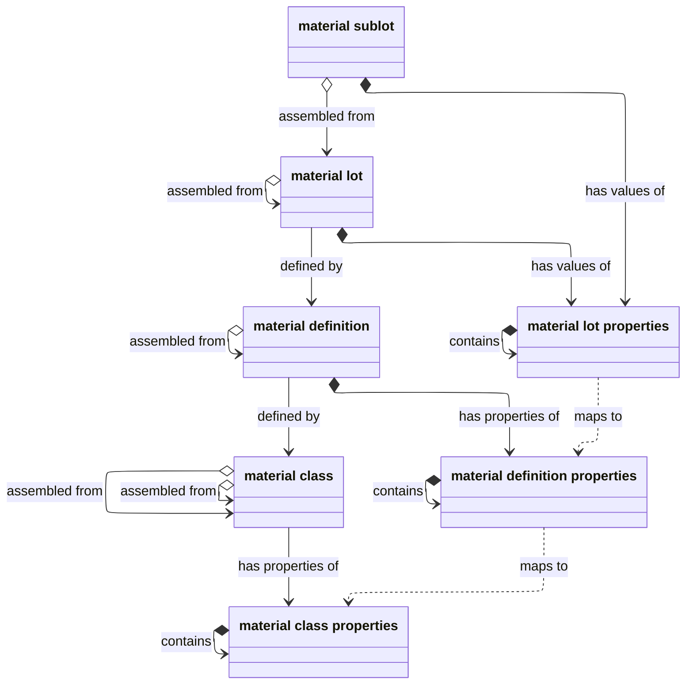
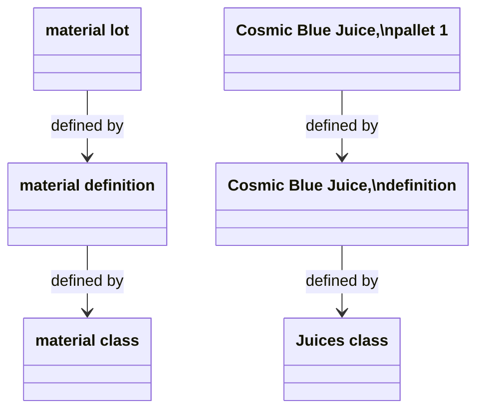
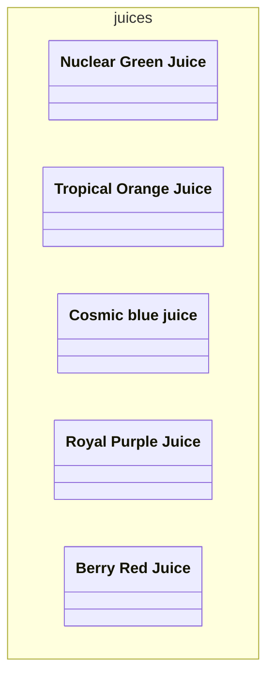
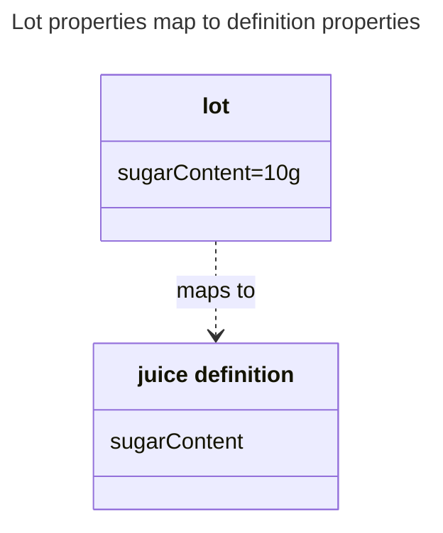
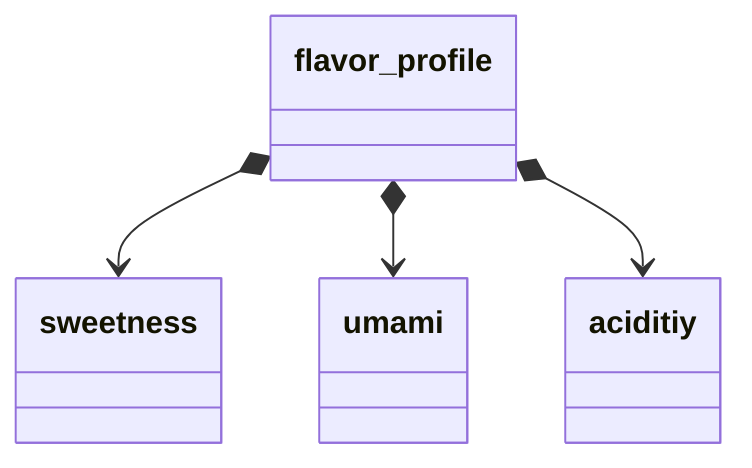

_Material_ can be a finished good or anything that goes into this good.
Examples of material include:
- A final product, such as packaged watch
- A part, such as a gear in this watch 
- An intermediate substance, such as a produced reactant that will be used in combination with another chemical
- Raw materials, like the flour and water that make dough

All manufacturing involves material transformation.
Some material goes in; new material goes out; and this process repeats until the final good is produced.

Like [equipment](), material can have classes and properties.
However, ISA-95 also can model the existence and production of every unique material component, or lot.
So, the material model has more entities than equipment.








## Defined by

The `defined by` relationship associates material with common categories and definitions. 



### Material lots are `defined by` material definitions

_Material definitions_ provide a way to ensure that one material name consistently refers to the same substance.
_Material lots_ provide a way to uniquely identify each specific instance of that definition.

For example, the Springfield plant might produce 100 pallets of its flagship product, `Cosmic Blue Juice`.
Obviously, these pallets are not literally the same: otherwise they would just be one pallet.
Rather, they are separate _lots_ that share the same material definition.


With this model, the Juice Factory can both:
- Create definitions to ensure consistent use and production of material
- Track unique material as it flow across production.

### Definitions are defined by classes

If you need another level of abstraction, you can also categorize your material definitions by _material class_.
For example, `The Juice Factory` has five juice definitions, all part of the class `Juices`.



Material classes provide a way to categorize material by function or shared [properties]({#material-properties}).
Note that material classes can contain material classes. For example, the `raw_materials` class might contain all raw ingredients.

```mermaid
---
subtitle: Material classes can contain material classes
---
classDiagram
namespace raw_materials{
  class sweeteners
  class flavors
  class colors
}
namespace sweeteners{
  class sugar
  class aspertame
}
namespace flavors{
  class `blue flavoring`
  class `orange flavoring`
}
namespace colors{
  class `blue`
  class `orange`
}


```

## Has values and properties {#material-properties}

Material lots and sublots can have values.
These values are stored in _material lot properties_.


  
This property may map to a property set for its material definition. And material definition properties may themselves map to class properties.

Note that class and definition properties do not have values since they are abstract. The lot, on the other hand, is real, so it has a value.
So the `Sweeteners` class, the `Cosmic blue juice` definition, and the `PBJ.1000.1` lot all might have a `sugarContent` property, but only the lot can have an actual value, such as `100`.


## Properties contain properties



As with equipment properties, all properties can contain properties.
For example, the property `flavor_profile` might contain properties for `sweetness`, `acidity` and `umami`.
