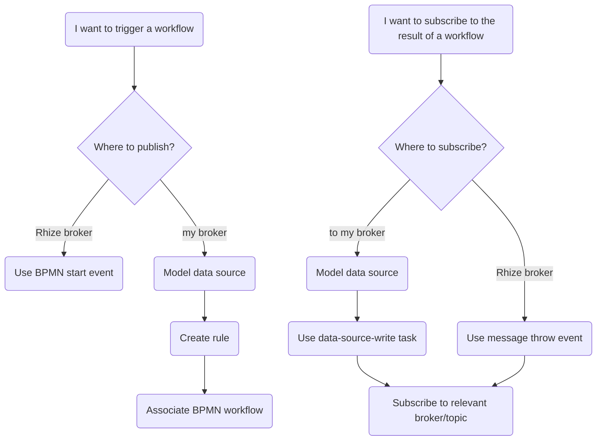

Rhize's  engine and UI provides a way to coordinate complex tasks and exchange messages between the Rhize platform and your internal services.
For example, you can use BPMN to coordinate messages between disparate systems, create alerts and events, and transform incoming work orders into their ISA-95 representation and store them in their Rhize DB.

Each workflow is configured through the same high-level process:
1. Set a start condition that initates the workflow. This condition may be a value from a data source or MQTT mesage, a scheduled timer, or a button pressed in frontend app.
1. Create logic to evaluate and transform data, send messages, and make calls to the Rhize DB and remote APIs.
1. Create end conditions to handle errors, validate data, and send messages.

This overview provides some high-level discussion of how Rhize's BPMN engine works with data and services and how to create triggers.
For a guide to writing a workflow, read [Create Workflows]().
For a detailed list of all elements, refer to the [BPMN elements]() reference.

## Message exchange

A BPMN workflow can publish and subscribe to both the Rhize message and to external data sources.
This provides substantial flexibility to create start conditions and to pass information between services.

For a more detailed discussion about what trigger to use, refer to the next section.

## Triggers

You also have multiple ways to  a BPMN.
The best choice of trigger depends on the context the event and system that initiates the workflow.

- **Message triggers.** You can start workflows by publishing to your broker or by publishing to this Rhize broker.

   If you want to initiate a workflow from a value changed in your data sources,
   [create a rule]().
   As rules evaluate properties from equipment, they commonly are triggers from data emitted by level-1 and level-2 systems, such as SCADAs.

   If you want to initiate a workflow by publishing to the Rhize broker, use a [message start event]().
   These messages often originate from level-3 and level-4 systems, such as ERPs.
- **[Timer events]().** These work according to a schedule, either one-off or repeating.
- **[API call]()**. You can also start a BPMN workflow by sending a  to the GraphQL API.
  A common use of API triggers is in low-code workflows. For example, an operator may press a button to start a workflow and wait for its response.

  To start BPMN workflows, Rhize has two primary API operations:

     - `createAndRunBpmn` starts a workflow and does not wait for the response (asynchronous).
     - `createAndRunBPMNSync` starts a workflow and waits for the process to complete or abort (synchronous)

## Data processing and API calls

Besides exchanging messages, BPMN workflows can also transform and evaluate payloads and make HTTP requests.
All the data in a process is stored in a  that each element can access.

The general logical elements are as follows:
- To evaluate conditions, use a [gateway]()
- To transform JSON expressions, use a [JSONata task]()
- To read an write data to the database, use a [GraphQL task]().
- To make a call to a remote HTTP API, use a [REST service task]().

[Examples of end-to-end workflows]().
