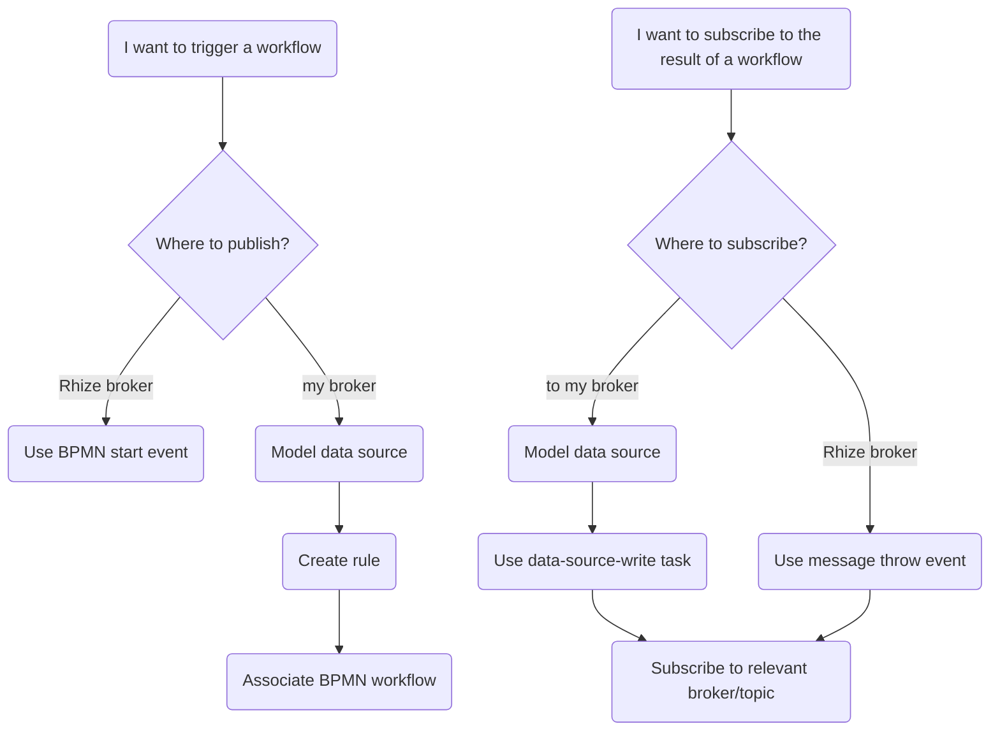

Rhize's BPMN engine and UI provides a way to coordinate complex tasks and exchange messages between the Rhize platform and your internal services.
For example, you can use BPMN to coordinate messages between systems, create alerts and events, transform incoming work orders into their ISA-95 representation, and store them in the Rhize DB.

Each workflow is configured through the same high-level process:
1. Set a start condition that initiates the workflow. This condition may be a value from a data source or MQTT message, a scheduled timer, or a button pressed in frontend app.
1. Create logic to evaluate and transform data, send messages, and call the Rhize DB and remote APIs.
1. Create end conditions to handle errors, validate data, and send messages.

This overview provides some high-level discussion of how Rhize's BPMN engine works with data and services and how to create triggers.
For a guide to writing a workflow, read [Create Workflows]().
For a detailed list of all elements, refer to the [BPMN elements]() reference.

## Start conditions

You have multiple ways to trigger a start condition.

{}

To learn more, read .

## Data processing and API calls

Besides exchanging messages, BPMN workflows can also transform and evaluate payloads and make HTTP requests.
All the data in a process is stored in a  that each element can access.

The general logical elements are as follows:
- To evaluate conditions, use an [exclusive gateway]().
- To calculate values and transform data use a [JSONata task]().
- To read and write data to the database, use a [GraphQL task]().
- To make a call to a remote HTTP API, use a [REST service task]().

[Examples of end-to-end workflows]().

## Message exchange

A BPMN workflow can publish and subscribe to both the Rhize message broker and external data sources.
This provides substantial flexibility to create start conditions and to pass information between services.

- To exchange messages on the Rhize broker, use [message start events]() and [message throw events]().
- To initiate workflows from an edge device, model a data source and [create a rule]().
- To read or write from a data source during a BPMN task, use the data-source service tasks.

