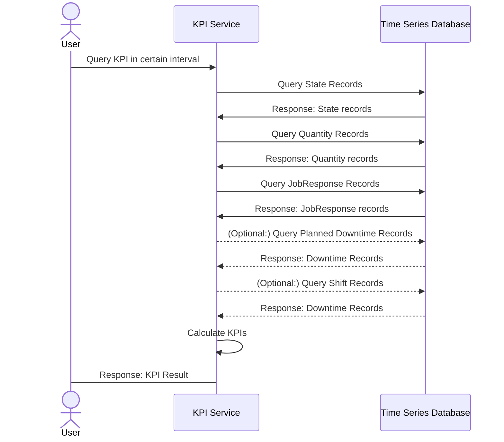

Key Performance Indicators (KPIs) in manufacturing serve as measurable metrics that help monitor, assess, and optimize the performance of various aspects of your production process.

Rhize has an optional `KPI` service that queries processs values persisted to a time series database and calculated various KPIs


Rhize's implementation of work calendars was inspired by ISO/TR
22400-10, a standard on KPIs in operations management.


## What the service does

The KPI service provides an interface in the graph database for the user to query a list of pre-defined KPIs on a piece of equipment in the `equipmentHierarchy` within a certain time interval.
The service then queries the time-series database for all state changes, produced quantities, and job response data.
With the returned data, the service calculates the KPI value and returns it to the user.

## Supported KPIs

The service currently supports all KPIs as provided by the `ISO/TR 22400-10` specification as well as some other useful KPIs:

- `ActualProductionTime`
- `ActualUnitSetupTime`
- `ActualSetupTime`
- `ActualUnitDelayTime`
- `ActualUnitDownTime`
- `TimeToRepair`
- `ActualUnitProcessingTime`
- `PlannedShutdownTime`
- `PlannedDownTime`
- `PlannedBusyTime`
- `Availability`
- `GoodQuantity`
- `ScrapQuantity`
- `ReworkQuantity`
- `ProducedQuantityMachineOrigin`
- `ProducedQuantity`
- `Effectiveness`
- `EffectivenessMachineOrigin`
- `QualityRatio`
- `OverallEquipmentEffectiveness`
- `ActualCycleTime`
- `ActualCycleTimeMachineOrigin`

