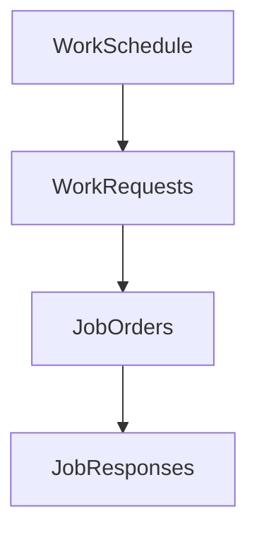
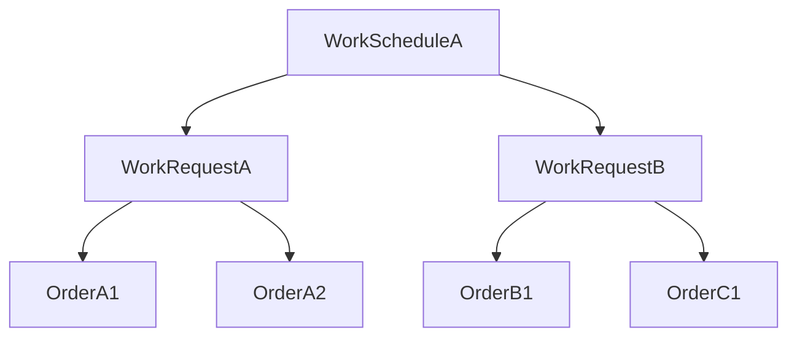



The KPI service offers a federated GraphQL interface to query KPI values.
This guide provides information on the different querying interfaces.

## Root level queries

The KPI service offers two root-level queries:

- `GetKPI()`
- `GetKPIByShift()`

### `GetKPI()`

The `GetKPI()` query is the base-level KPI Query.
You can use it to input an equipment ID or hierarchy-scope ID, a time range, and a list of desired KPIs.
The result is a single KPI object per requested KPI.

#### GetKPI() - Definition


{}
query:

```graphql
query GetKPI($filterInput: KPIFilter!, $startDateTime: DateTime!, $endDateTime: DateTime!, $kpi: [KPI!], $ignorePlannedDownTime: Boolean, $ignorePlannedShutdownTime: Boolean) {
  GetKPI(filterInput: $filterInput, startDateTime: $startDateTime, endDateTime: $endDateTime, kpi: $kpi, ignorePlannedDownTime: $ignorePlannedDownTime, ignorePlannedShutdownTime: $ignorePlannedShutdownTime) {
    name
    to
    from
    error
    value
    units
  }
}
```

input:

```json
{
  "filterInput": {
    "equipmentIds": ["MachineA", "MachineB"],
    "hierarchyScopeId": "Enterprise1.SiteA.Line1"
  },
  "startDateTime": "2024-09-01T00:00:00Z",
  "endDateTime": "2024-09-01T18:00:00Z",
  "kpi": ["ActualProductionTime","Availability", "GoodQuantity", "ProducedQuantity", "Effectiveness", "QualityRatio", "ActualCycleTime", "OverallEquipmentEffectiveness"],
  "ignorePlannedDownTime": false,
  "ignorePlannedShutdownTime": false,
  "onlyIncludeActiveJobResponses": false
}
```

{}
{}

```json
{
  "data": {
    "GetKPI": [
      {
        "name": "ActualProductionTime",
        "to": "2024-09-01T18:00:00Z",
        "from": "2024-09-01T00:00:00Z",
        "error": null,
        "value": 0,
        "units": "seconds"
      },
      {
        "name": "ActualUnitDelayTime",
        "to": "2024-09-01T18:00:00Z",
        "from": "2024-09-01T00:00:00Z",
        "error": null,
        "value": 0,
        "units": "seconds"
      },
      {
        "name": "PlannedDownTime",
        "to": "2024-09-01T18:00:00Z",
        "from": "2024-09-01T00:00:00Z",
        "error": null,
        "value": 0,
        "units": "seconds"
      },
      {
        "name": "Availability",
        "to": "2024-09-01T18:00:00Z",
        "from": "2024-09-01T00:00:00Z",
        "error": null,
        "value": 0,
        "units": "%"
      },
      {
        "name": "GoodQuantity",
        "to": "2024-09-01T18:00:00Z",
        "from": "2024-09-01T00:00:00Z",
        "error": null,
        "value": 0,
        "units": "units"
      },
      {
        "name": "ProducedQuantity",
        "to": "2024-09-01T18:00:00Z",
        "from": "2024-09-01T00:00:00Z",
        "error": null,
        "value": 0,
        "units": "units"
      },
      {
        "name": "Effectiveness",
        "to": "2024-09-01T18:00:00Z",
        "from": "2024-09-01T00:00:00Z",
        "error": null,
        "value": 100,
        "units": "%"
      },
      {
        "name": "QualityRatio",
        "to": "2024-09-01T18:00:00Z",
        "from": "2024-09-01T00:00:00Z",
        "error": null,
        "value": 100,
        "units": "%"
      },
      {
        "name": "ActualCycleTime",
        "to": "2024-09-01T18:00:00Z",
        "from": "2024-09-01T00:00:00Z",
        "error": null,
        "value": 0,
        "units": "seconds per unit"
      },
      {
        "name": "OverallEquipmentEffectiveness",
        "to": "2024-09-01T18:00:00Z",
        "from": "2024-09-01T00:00:00Z",
        "error": null,
        "value": 0,
        "units": "%"
      }
    ]
  }
}
```

{}


#### Example 1.

Imagine a scenario where `Machine A` produces parts at a planned cycle time of 10-seconds per part.
The order starts at 09:00 and finishes at 12:00 with 30 minutes of unplanned downtime in between (this could be from loading materials, unplanned maintenance, switching tools, and so on).
After the operation finishes, the user has registered 800 Good parts and 200 scrap parts.
The tables in time series appear as follows:


{}

| EquipmentId | ISO22400State | time                 |
|-------------|---------------|----------------------|
| Machine A   | APT           | 2024-09-03T09:00:00Z |
| Machine A   | ADET          | 2024-09-03T10:30:00Z |
| Machine A   | APT           | 2024-09-03T11:00:00Z |
| Machine A   | ADOT          | 2024-09-03T12:00:00Z |

{}
{}

| EquipmentId | Origin | QtyType | ProductionType | Qty | time                 |
|-------------|--------|---------|----------------|-----|----------------------|
| Machine A   | User   | Delta   | Good           | 800 | 2024-09-03T12:00:00Z |
| Machine A   | User   | Delta   | Scrap          | 200 | 2024-09-03T12:00:00Z |

{}
{}

| EquipmentId | JobOrderId | PlanningCyleTime | time                 |
|-------------|------------|------------------|----------------------|
| Machine A   | Order A    | 10               | 2024-09-03T09:00:00Z |
| Machine A   | NONE       | 0                | 2024-09-03T12:00:00Z |

{}


Calling this KPI Query appears as follows:


{}
query:

```graphql
query GetKPI($filterInput: KPIFilter!, $startDateTime: DateTime!, $endDateTime: DateTime!, $kpi: [KPI!], $ignorePlannedDownTime: Boolean, $ignorePlannedShutdownTime: Boolean) {
  GetKPI(filterInput: $filterInput, startDateTime: $startDateTime, endDateTime: $endDateTime, kpi: $kpi, ignorePlannedDownTime: $ignorePlannedDownTime, ignorePlannedShutdownTime: $ignorePlannedShutdownTime) {
    name
    to
    from
    error
    value
    units
  }
}
```

input:

```json
{
  "filterInput": {
    "equipmentIds": ["MachineA"]
  },
  "startDateTime": "2024-09-03T09:00:00Z",
  "endDateTime": "2024-09-03T12:00:00Z",
  "kpi": ["ActualProductionTime","Availability", "GoodQuantity", "ProducedQuantity", "Effectiveness", "QualityRatio", "ActualCycleTime", "OverallEquipmentEffectiveness"]
}
```

{}
{}

```json
{
  "data": {
    "GetKPI": [
      {
        "_comment": "This is the total time spent in APT",
        "name": "ActualProductionTime",
        "to": "2024-09-01T18:00:00Z",
        "from": "2024-09-01T00:00:00Z",
        "error": null,
        "value": 9000,
        "units": "seconds"
      },
      {
        "_comment": "This is the total time spent in ADET",
        "name": "ActualUnitDelayTime",
        "to": "2024-09-01T18:00:00Z",
        "from": "2024-09-01T00:00:00Z",
        "error": null,
        "value": 1800,
        "units": "seconds"
      },
      {
        "_comment": "This is the total time spent in PDOT",
        "name": "PlannedDownTime",
        "to": "2024-09-01T18:00:00Z",
        "from": "2024-09-01T00:00:00Z",
        "error": null,
        "value": 0,
        "units": "seconds"
      },
      {
        "_comment": "This is APT/PBT",
        "name": "Availability",
        "to": "2024-09-01T18:00:00Z",
        "from": "2024-09-01T00:00:00Z",
        "error": null,
        "value": 83.3333333,
        "units": "%"
      },
      {
        "_comment": "This is the total recorded good quantity",
        "name": "GoodQuantity",
        "to": "2024-09-01T18:00:00Z",
        "from": "2024-09-01T00:00:00Z",
        "error": null,
        "value": 800,
        "units": "units"
      },
      {
        "_comment": "This is the total quantity produced in the order",
        "name": "ProducedQuantity",
        "to": "2024-09-01T18:00:00Z",
        "from": "2024-09-01T00:00:00Z",
        "error": null,
        "value": 1000,
        "units": "units"
      },
      {"_comment": "This is (ProducedQuantity * PlannedCycleTime)/APT",
        "name": "Effectiveness",
        "to": "2024-09-01T18:00:00Z",
        "from": "2024-09-01T00:00:00Z",
        "error": null,
        "value": 111.111111,
        "units": "%"
      },
      {
        "_comment": "This is GoodQuantity/ProducedQuantity",
        "name": "QualityRatio",
        "to": "2024-09-01T18:00:00Z",
        "from": "2024-09-01T00:00:00Z",
        "error": null,
        "value": 80,
        "units": "%"
      },
      {
        "_comment": "This is APT/ProducedQuantity",
        "name": "ActualCycleTime",
        "to": "2024-09-01T18:00:00Z",
        "from": "2024-09-01T00:00:00Z",
        "error": null,
        "value": 10.8,
        "units": "seconds per unit"
      },
      {
        "_comment": "This is Availability * Effectiveness * QualityRatio",
        "name": "OverallEquipmentEffectiveness",
        "to": "2024-09-01T18:00:00Z",
        "from": "2024-09-01T00:00:00Z",
        "error": null,
        "value": 74.074,
        "units": "%"
      }
    ]
  }
}
```

{}


### `GetKPIByShift()`

The `GetKPIByShift()` query is another base-level KPI Query.
It is similar to GetKPI(), but rather than returning a single result per KPI query, it also accepts `WorkCalendarEntryProperty IDs` to filter against and return a result for each instance of a shift.

#### GetKPIByShift() - Definition


{}
query:

```graphql
query GetKPIByShift($filterInput: GetKPIByShiftFilter!, $startDateTime: DateTime!, $endDateTime: DateTime!, $kpi: [KPI!], $ignorePlannedDownTime: Boolean, $ignorePlannedShutdownTime: Boolean, $groupByShift: Boolean, $groupByEquipment: Boolean, $onlyIncludeActiveJobResponses: Boolean) {
  GetKPIByShift(filterInput: $filterInput, startDateTime: $startDateTime, endDateTime: $endDateTime, kpi: $kpi, ignorePlannedDownTime: $ignorePlannedDownTime, ignorePlannedShutdownTime: $ignorePlannedShutdownTime, groupByShift: $groupByShift, groupByEquipment: $groupByEquipment, OnlyIncludeActiveJobResponses: $onlyIncludeActiveJobResponses) {
    name
    equipmentIds
    shiftsContained
    from
    to
    error
    value
    units
  }
}
```

input:

```json
{
  "filterInput": {
    "shiftFilter": [
      {
        "propertyName": "Shift Name",
        "eq": "Morning"
      }
    ],
    "equipmentIds": ["Machine A", "Machine B"],
    "hierarchyScopeId": "Enterprise1.SiteA.Line1"
  },
  "startDateTime": "2024-09-01T00:00:00Z",
  "endDateTime": "2024-09-03T18:00:00Z",
  "kpi": ["ActualProductionTime", "OverallEquipmentEffectiveness"],
  "ignorePlannedDownTime": false,
  "ignorePlannedShutdownTime": false,
  "onlyIncludeActiveJobResponses": false,
  "groupByShift": false,
  "groupByEquipment": true
}
```

{}
{}

```json
{
  "data": {
    "GetKPIByShift": [
      {
        "name": "ActualProductionTime",
        "equipmentIds": ["Machine A", "Machine B"],
        "shiftsContained": ["Shift.Sunday.Morning"],
        "from": "2024-09-01T09:00:00Z",
        "to": "2024-09-01T17:00:00Z",
        "error": null,
        "value": 0,
        "units": "seconds"
      },
      {
        "name": "ActualProductionTime",
        "equipmentIds": ["Machine A", "Machine B"],
        "shiftsContained": ["Shift.Monday.Morning"],
        "from": "2024-09-02T00:00:00Z",
        "to": "2024-09-02T17:00:00Z",
        "error": null,
        "value": 0,
        "units": "seconds"
      },
      {
        "name": "ActualProductionTime",
        "equipmentIds": ["Machine A", "Machine B"],
        "shiftsContained": ["Shift.Tuesday.Morning"],
        "from": "2024-09-03T00:00:00Z",
        "to": "2024-09-03T17:00:00Z",
        "error": null,
        "value": 0,
        "units": "seconds"
      },
       {
        "name": "OverallEquipmentEffectiveness",
        "equipmentIds": ["Machine A", "Machine B"],
        "shiftsContained": ["Shift.Sunday.Morning"],
        "from": "2024-09-01T09:00:00Z",
        "to": "2024-09-01T17:00:00Z",
        "error": null,
        "value": 0,
        "units": "%"
      },
      {
        "name": "OverallEquipmentEffectiveness",
        "equipmentIds": ["Machine A", "Machine B"],
        "shiftsContained": ["Shift.Monday.Morning"],
        "from": "2024-09-02T00:00:00Z",
        "to": "2024-09-02T17:00:00Z",
        "error": null,
        "value": 0,
        "units": "%"
      },
      {
        "name": "OverallEquipmentEffectiveness",
        "equipmentIds": ["Machine A", "Machine B"],
        "shiftsContained": ["Shift.Tuesday.Morning"],
        "from": "2024-09-03T00:00:00Z",
        "to": "2024-09-03T17:00:00Z",
        "error": null,
        "value": 0,
        "units": "%"
      },
    ]
  }
}
```

{}


#### Example 2

Following on from Example 1. `Machine A` exists on a production line alongside `Machine B`, they both produce parts with a planned cycle time of 10 seconds per part and runs on the same shift pattern. The [work calendar service]() is configured with 3 distinct daily shifts:

- Morning (06:00-14:00)
- Afternoon (14:00 - 22:00)
- Night (22:00-06:00)

Which results in the following tables:


{}

| EquipmentId | ISO22400State | time                 |
|-------------|---------------|----------------------|
| Machine A   | APT           | 2024-09-01T06:00:00Z |
| Machine B   | APT           | 2024-09-01T06:00:00Z |
| Machine A   | ADET          | 2024-09-01T10:30:00Z |
| Machine B   | ADET          | 2024-09-01T10:30:00Z |
| Machine A   | APT           | 2024-09-01T11:00:00Z |
| Machine B   | APT           | 2024-09-01T11:00:00Z |
| Machine A   | ADOT          | 2024-09-01T14:00:00Z |
| Machine B   | ADOT          | 2024-09-01T14:00:00Z |
| Machine A   | APT           | 2024-09-01T14:00:00Z |
| Machine B   | APT           | 2024-09-01T14:00:00Z |
| Machine A   | ADET          | 2024-09-01T17:30:00Z |
| Machine B   | ADET          | 2024-09-01T17:30:00Z |
| Machine A   | APT           | 2024-09-01T18:00:00Z |
| Machine B   | APT           | 2024-09-01T18:00:00Z |
| Machine A   | ADOT          | 2024-09-01T22:00:00Z |
| Machine B   | ADOT          | 2024-09-01T22:00:00Z |
| Machine A   | APT           | 2024-09-01T22:00:00Z |
| Machine B   | APT           | 2024-09-01T22:00:00Z |
| Machine A   | ADET          | 2024-09-02T04:00:00Z |
| Machine B   | ADET          | 2024-09-02T04:00:00Z |
| Machine A   | APT           | 2024-09-02T04:30:00Z |
| Machine B   | APT           | 2024-09-02T04:30:00Z |
| Machine A   | ADOT          | 2024-09-02T06:00:00Z |
| Machine B   | ADOT          | 2024-09-02T06:00:00Z |
| Machine A   | APT           | 2024-09-02T06:00:00Z |
| Machine B   | APT           | 2024-09-02T06:00:00Z |
| Machine A   | ADET          | 2024-09-02T10:30:00Z |
| Machine B   | ADET          | 2024-09-02T10:30:00Z |
| Machine A   | APT           | 2024-09-02T11:00:00Z |
| Machine B   | APT           | 2024-09-02T11:00:00Z |
| Machine A   | ADOT          | 2024-09-02T14:00:00Z |
| Machine B   | ADOT          | 2024-09-02T14:00:00Z |
| Machine A   | APT           | 2024-09-02T14:00:00Z |
| Machine B   | APT           | 2024-09-02T14:00:00Z |
| Machine A   | ADET          | 2024-09-02T18:30:00Z |
| Machine B   | ADET          | 2024-09-02T18:30:00Z |
| Machine A   | APT           | 2024-09-02T19:00:00Z |
| Machine B   | APT           | 2024-09-02T19:00:00Z |
| Machine A   | ADOT          | 2024-09-02T22:00:00Z |
| Machine B   | ADOT          | 2024-09-02T22:00:00Z |
| Machine A   | APT           | 2024-09-02T22:00:00Z |
| Machine B   | APT           | 2024-09-02T22:00:00Z |
| Machine A   | ADET          | 2024-09-03T04:30:00Z |
| Machine B   | ADET          | 2024-09-03T04:30:00Z |
| Machine A   | APT           | 2024-09-03T05:00:00Z |
| Machine B   | APT           | 2024-09-03T05:00:00Z |
| Machine A   | ADOT          | 2024-09-03T06:00:00Z |
| Machine B   | ADOT          | 2024-09-03T06:00:00Z |

{}
{}

| EquipmentId | Origin | QtyType | ProductionType | Qty | time                 |
|-------------|--------|---------|----------------|-----|----------------------|
| Machine A   | User   | Delta   | Good           | 800 | 2024-09-01T14:00:00Z |
| Machine A   | User   | Delta   | Scrap          | 200 | 2024-09-01T14:00:00Z |
| Machine B   | User   | Delta   | Good           | 700 | 2024-09-01T14:00:00Z |
| Machine B   | User   | Delta   | Scrap          | 300 | 2024-09-01T14:00:00Z |
| Machine A   | User   | Delta   | Good           | 900 | 2024-09-01T22:00:00Z |
| Machine A   | User   | Delta   | Scrap          | 100 | 2024-09-01T22:00:00Z |
| Machine B   | User   | Delta   | Good           | 950 | 2024-09-01T22:00:00Z |
| Machine B   | User   | Delta   | Scrap          | 50  | 2024-09-01T22:00:00Z |
| Machine A   | User   | Delta   | Good           | 999 | 2024-09-01T06:00:00Z |
| Machine A   | User   | Delta   | Scrap          | 1   | 2024-09-01T06:00:00Z |
| Machine B   | User   | Delta   | Good           | 900 | 2024-09-01T06:00:00Z |
| Machine B   | User   | Delta   | Scrap          | 100 | 2024-09-01T06:00:00Z |
| Machine A   | User   | Delta   | Good           | 850 | 2024-09-02T14:00:00Z |
| Machine A   | User   | Delta   | Scrap          | 150 | 2024-09-02T14:00:00Z |
| Machine B   | User   | Delta   | Good           | 800 | 2024-09-02T14:00:00Z |
| Machine B   | User   | Delta   | Scrap          | 200 | 2024-09-02T14:00:00Z |
| Machine A   | User   | Delta   | Good           | 700 | 2024-09-02T22:00:00Z |
| Machine A   | User   | Delta   | Scrap          | 300 | 2024-09-02T22:00:00Z |
| Machine B   | User   | Delta   | Good           | 750 | 2024-09-02T22:00:00Z |
| Machine B   | User   | Delta   | Scrap          | 250 | 2024-09-02T22:00:00Z |
| Machine A   | User   | Delta   | Good           | 600 | 2024-09-02T06:00:00Z |
| Machine A   | User   | Delta   | Scrap          | 400 | 2024-09-02T06:00:00Z |
| Machine B   | User   | Delta   | Good           | 750 | 2024-09-02T06:00:00Z |
| Machine B   | User   | Delta   | Scrap          | 250 | 2024-09-02T06:00:00Z |

{}
{}

| EquipmentId | JobOrderId  | PlanningCyleTime | time                 |
|-------------|-------------|------------------|----------------------|
| Machine A   | Order A1    | 10               | 2024-09-01T06:00:00Z |
| Machine B   | Order A2    | 10               | 2024-09-01T06:00:00Z |
| Machine A   | NONE        | 0                | 2024-09-01T14:00:00Z |
| Machine B   | NONE        | 0                | 2024-09-01T14:00:00Z |
| Machine A   | Order B1    | 10               | 2024-09-01T14:00:00Z |
| Machine B   | Order B2    | 10               | 2024-09-01T14:00:00Z |
| Machine A   | NONE        | 0                | 2024-09-01T22:00:00Z |
| Machine B   | NONE        | 0                | 2024-09-01T22:00:00Z |
| Machine A   | Order C1    | 10               | 2024-09-01T22:00:00Z |
| Machine B   | Order C2    | 10               | 2024-09-01T22:00:00Z |
| Machine A   | NONE        | 0                | 2024-09-02T06:00:00Z |
| Machine B   | NONE        | 0                | 2024-09-02T06:00:00Z |
| Machine A   | Order D1    | 10               | 2024-09-02T06:00:00Z |
| Machine B   | Order D2    | 10               | 2024-09-02T06:00:00Z |
| Machine A   | NONE        | 0                | 2024-09-02T14:00:00Z |
| Machine B   | NONE        | 0                | 2024-09-02T14:00:00Z |
| Machine A   | Order E1    | 10               | 2024-09-02T14:00:00Z |
| Machine B   | Order E2    | 10               | 2024-09-02T14:00:00Z |
| Machine A   | NONE        | 0                | 2024-09-02T22:00:00Z |
| Machine B   | NONE        | 0                | 2024-09-02T22:00:00Z |
| Machine A   | Order F1    | 10               | 2024-09-02T22:00:00Z |
| Machine B   | Order F2    | 10               | 2024-09-02T22:00:00Z |
| Machine A   | NONE        | 0                | 2024-09-03T06:00:00Z |
| Machine B   | NONE        | 0                | 2024-09-03T06:00:00Z |

{}
{}

| EquipmentId | WorkCalendarDefinitionID | WorkCalendarDefinitionEntryId    | EntryType | time                 |
|-------------|--------------------------|----------------------------------|-----------|----------------------|
| Machine A   | ShiftCalendar            | ShiftCalendar.Sunday.Morning     | START     | 2024-09-01T06:00:00Z |
| Machine B   | ShiftCalendar            | ShiftCalendar.Sunday.Morning     | START     | 2024-09-01T06:00:00Z |
| Machine A   | ShiftCalendar            | ShiftCalendar.Sunday.Morning     | END       | 2024-09-01T14:00:00Z |
| Machine B   | ShiftCalendar            | ShiftCalendar.Sunday.Morning     | END       | 2024-09-01T14:00:00Z |
| Machine A   | ShiftCalendar            | ShiftCalendar.Sunday.Afternoon   | START     | 2024-09-01T14:00:00Z |
| Machine B   | ShiftCalendar            | ShiftCalendar.Sunday.Afternoon   | START     | 2024-09-01T14:00:00Z |
| Machine A   | ShiftCalendar            | ShiftCalendar.Sunday.Afternoon   | END       | 2024-09-01T22:00:00Z |
| Machine B   | ShiftCalendar            | ShiftCalendar.Sunday.Afternoon   | END       | 2024-09-01T22:00:00Z |
| Machine A   | ShiftCalendar            | ShiftCalendar.Sunday.Night       | START     | 2024-09-01T22:00:00Z |
| Machine B   | ShiftCalendar            | ShiftCalendar.Sunday.Night       | START     | 2024-09-01T22:00:00Z |
| Machine A   | ShiftCalendar            | ShiftCalendar.Sunday.Night       | END       | 2024-09-02T06:00:00Z |
| Machine B   | ShiftCalendar            | ShiftCalendar.Sunday.Night       | END       | 2024-09-02T06:00:00Z |
| Machine A   | ShiftCalendar            | ShiftCalendar.Monday.Morning     | START     | 2024-09-02T06:00:00Z |
| Machine B   | ShiftCalendar            | ShiftCalendar.Monday.Morning     | START     | 2024-09-02T06:00:00Z |
| Machine A   | ShiftCalendar            | ShiftCalendar.Monday.Morning     | END       | 2024-09-02T14:00:00Z |
| Machine B   | ShiftCalendar            | ShiftCalendar.Monday.Morning     | END       | 2024-09-02T14:00:00Z |
| Machine A   | ShiftCalendar            | ShiftCalendar.Monday.Afternoon   | START     | 2024-09-02T14:00:00Z |
| Machine B   | ShiftCalendar            | ShiftCalendar.Monday.Afternoon   | START     | 2024-09-02T14:00:00Z |
| Machine A   | ShiftCalendar            | ShiftCalendar.Monday.Afternoon   | END       | 2024-09-02T22:00:00Z |
| Machine B   | ShiftCalendar            | ShiftCalendar.Monday.Afternoon   | END       | 2024-09-02T22:00:00Z |
| Machine A   | ShiftCalendar            | ShiftCalendar.Monday.Night       | START     | 2024-09-02T22:00:00Z |
| Machine B   | ShiftCalendar            | ShiftCalendar.Monday.Night       | START     | 2024-09-02T22:00:00Z |
| Machine A   | ShiftCalendar            | ShiftCalendar.Monday.Night       | END       | 2024-09-03T06:00:00Z |
| Machine B   | ShiftCalendar            | ShiftCalendar.Monday.Night       | END       | 2024-09-03T06:00:00Z |

{}


You can run this query in multiple ways:

- **`groupByEquipment = false and groupByShift = false` -** returns a separate result per shift instance per equipment


{}
query:

```graphql
query GetKPIByShift($filterInput: GetKPIByShiftFilter!, $startDateTime: DateTime!, $endDateTime: DateTime!, $kpi: [KPI!], $ignorePlannedDownTime: Boolean, $ignorePlannedShutdownTime: Boolean, $groupByShift: Boolean, $groupByEquipment: Boolean, $onlyIncludeActiveJobResponses: Boolean) {
  GetKPIByShift(filterInput: $filterInput, startDateTime: $startDateTime, endDateTime: $endDateTime, kpi: $kpi, ignorePlannedDownTime: $ignorePlannedDownTime, ignorePlannedShutdownTime: $ignorePlannedShutdownTime, groupByShift: $groupByShift, groupByEquipment: $groupByEquipment, OnlyIncludeActiveJobResponses: $onlyIncludeActiveJobResponses) {
    name
    equipmentIds
    shiftsContained
    from
    to
    error
    value
    units
  }
}
```

input:

```json
{
  "filterInput": {
    "shiftFilter": [
      {
        "propertyName": "Shift Name",
        "eq": "Morning"
      }
    ],
    "equipmentIds": ["Machine A", "Machine B"],
  },
  "startDateTime": "2024-09-01T00:00:00Z",
  "endDateTime": "2024-09-03T18:00:00Z",
  "kpi": ["ActualProductionTime"],
  "ignorePlannedDownTime": false,
  "ignorePlannedShutdownTime": false,
  "onlyIncludeActiveJobResponses": false,
  "groupByShift": false,
  "groupByEquipment": false
}
```

{}
{}

```json
{
  "data": {
    "GetKPIByShift": [
      {
        "name": "ActualProductionTime",
        "equipmentIds": ["Machine A"],
        "shiftsContained": ["Shift.Sunday.Morning"],
        "from": "2024-09-01T06:00:00Z",
        "to": "2024-09-01T14:00:00Z",
        "error": null,
        "value": 27000,
        "units": "seconds"
      },
      {
        "name": "ActualProductionTime",
        "equipmentIds": ["Machine B"],
        "shiftsContained": ["Shift.Sunday.Morning"],
        "from": "2024-09-01T06:00:00Z",
        "to": "2024-09-01T14:00:00Z",
        "error": null,
        "value": 27000,
        "units": "seconds"
      },
      {
        "name": "ActualProductionTime",
        "equipmentIds": ["Machine A"],
        "shiftsContained": ["Shift.Monday.Morning"],
        "from": "2024-09-02T06:00:00Z",
        "to": "2024-09-02T14:00:00Z",
        "error": null,
        "value": 27000,
        "units": "seconds"
      },
      {
        "name": "ActualProductionTime",
        "equipmentIds": ["Machine B"],
        "shiftsContained": ["Shift.Monday.Morning"],
        "from": "2024-09-02T06:00:00Z",
        "to": "2024-09-02T14:00:00Z",
        "error": null,
        "value": 27000,
        "units": "seconds"
      }
    ]
  }
}
```

{}


- **`groupByEquipment = true and groupByShift = false` -** returns a separate result per shift instance containing all equipment


{}
query:

```graphql
query GetKPIByShift($filterInput: GetKPIByShiftFilter!, $startDateTime: DateTime!, $endDateTime: DateTime!, $kpi: [KPI!], $ignorePlannedDownTime: Boolean, $ignorePlannedShutdownTime: Boolean, $groupByShift: Boolean, $groupByEquipment: Boolean, $onlyIncludeActiveJobResponses: Boolean) {
  GetKPIByShift(filterInput: $filterInput, startDateTime: $startDateTime, endDateTime: $endDateTime, kpi: $kpi, ignorePlannedDownTime: $ignorePlannedDownTime, ignorePlannedShutdownTime: $ignorePlannedShutdownTime, groupByShift: $groupByShift, groupByEquipment: $groupByEquipment, OnlyIncludeActiveJobResponses: $onlyIncludeActiveJobResponses) {
    name
    equipmentIds
    shiftsContained
    from
    to
    error
    value
    units
  }
}
```

input:

```json
{
  "filterInput": {
    "shiftFilter": [
      {
        "propertyName": "Shift Name",
        "eq": "Morning"
      }
    ],
    "equipmentIds": ["Machine A", "Machine B"],
  },
  "startDateTime": "2024-09-01T00:00:00Z",
  "endDateTime": "2024-09-03T18:00:00Z",
  "kpi": ["ActualProductionTime"],
  "ignorePlannedDownTime": false,
  "ignorePlannedShutdownTime": false,
  "onlyIncludeActiveJobResponses": false,
  "groupByShift": false,
  "groupByEquipment": true
}
```

{}
{}

```json
{
  "data": {
    "GetKPIByShift": [
      {
        "name": "ActualProductionTime",
        "equipmentIds": ["Machine A", "Machine B"],
        "shiftsContained": ["Shift.Sunday.Morning"],
        "from": "2024-09-01T06:00:00Z",
        "to": "2024-09-01T14:00:00Z",
        "error": null,
        "value": 54000,
        "units": "seconds"
      },
      {
        "name": "ActualProductionTime",
        "equipmentIds": ["Machine A", "Machine B"],
        "shiftsContained": ["Shift.Monday.Morning"],
        "from": "2024-09-02T06:00:00Z",
        "to": "2024-09-02T14:00:00Z",
        "error": null,
        "value": 54000,
        "units": "seconds"
      }

    ]
  }
}
```

{}


- **groupByEquipment = true and groupByShift = true -** groups shifts and equipment together


{}
query:

```graphql
query GetKPIByShift($filterInput: GetKPIByShiftFilter!, $startDateTime: DateTime!, $endDateTime: DateTime!, $kpi: [KPI!], $ignorePlannedDownTime: Boolean, $ignorePlannedShutdownTime: Boolean, $groupByShift: Boolean, $groupByEquipment: Boolean, $onlyIncludeActiveJobResponses: Boolean) {
  GetKPIByShift(filterInput: $filterInput, startDateTime: $startDateTime, endDateTime: $endDateTime, kpi: $kpi, ignorePlannedDownTime: $ignorePlannedDownTime, ignorePlannedShutdownTime: $ignorePlannedShutdownTime, groupByShift: $groupByShift, groupByEquipment: $groupByEquipment, OnlyIncludeActiveJobResponses: $onlyIncludeActiveJobResponses) {
    name
    equipmentIds
    shiftsContained
    from
    to
    error
    value
    units
  }
}
```

input:

```json
{
  "filterInput": {
    "shiftFilter": [
      {
        "propertyName": "Shift Name",
        "eq": "Morning"
      }
    ],
    "equipmentIds": ["Machine A", "Machine B"],
  },
  "startDateTime": "2024-09-01T00:00:00Z",
  "endDateTime": "2024-09-03T18:00:00Z",
  "kpi": ["ActualProductionTime"],
  "ignorePlannedDownTime": false,
  "ignorePlannedShutdownTime": false,
  "onlyIncludeActiveJobResponses": false,
  "groupByShift": true,
  "groupByEquipment": true
}
```

{}
{}

```json
{
  "data": {
    "GetKPIByShift": [
      {
        "name": "ActualProductionTime",
        "equipmentIds": ["Machine A", "Machine B"],
        "shiftsContained": ["Shift.Sunday.Morning","Shift.Monday.Morning"],
        "from": "2024-09-01T06:00:00Z",
        "to": "2024-09-01T14:00:00Z",
        "error": null,
        "value": 108000,
        "units": "seconds"
      }

    ]
  }
}
```

{}


## Federated Queries

The KPI service extends the equipment, work schedule, work request, job order, and job response GraphQL entities with a KPI object.
This makes KPIs easier to query.

### Query Equipment

Extending the equipment type allows the equipment ID to be inferred from parent equipment type


{}
query:

```graphql
query QueryEquipment($startDateTime: DateTime!, $endDateTime: DateTime!, $kpi: [KPI!], $ignorePlannedDownTime: Boolean, $ignorePlannedShutdownTime: Boolean) {
  queryEquipment {
    id
    kpi(startDateTime: $startDateTime, endDateTime: $endDateTime, kpi: $kpi, ignorePlannedDownTime: $ignorePlannedDownTime, ignorePlannedShutdownTime: $ignorePlannedShutdownTime) {
      name
      from
      to
      error
      value
      units
    }
  }
}
```

input:

```json
{
  "startDateTime": "2024-09-01T06:00:00Z",
  "endDateTime": "2024-09-01T14:00:00Z",
  "kpi": ["ActualProductionTime"],
  "ignorePlannedDownTime": false,
  "ignorePlannedShutdownTime": false
}
```

{}
{}

```json
{
  "data": {
    "queryEquipment": [
      {
        "id": "Machine A",
        "kpi": [
          {
            "name": "ActualProductionTime",
            "from": "2024-09-01T06:00:00Z",
            "to": "2024-09-01T14:00:00Z",
            "error": null,
            "value": 27000,
            "units": "seconds"
          }
        ]
      },
      {
        "id": "Machine B",
        "kpi": [
          {
            "name": "ActualProductionTime",
            "from": "2024-09-01T06:00:00Z",
            "to": "2024-09-01T14:00:00Z",
            "error": null,
            "value": 27000,
            "units": "seconds"
          }
        ]
      }
    ]
  }
}
```

{}


### Query JobResponse

Extending the job response type allows:

- `startDateTime` to be inferred from `jobResponse.startDateTime`
- `endDateTime` to be inferred from `jobResponse.endDateTime`
- `equipmentIds` to be inferred from `jobResponse.equipmentActual.EquipmentVersion.id`


{}
query:

```graphql
query QueryJobResponse($kpi: [KPI!], $ignorePlannedDownTime: Boolean, $ignorePlannedShutdownTime: Boolean, $filter: KPIFilter) {
  queryJobResponse {
    id
    startDateTime
    endDateTime
    equipmentActual {
      id
      equipmentVersion {
        id
      }
    }
    kpi(kpi: $kpi, ignorePlannedDownTime: $ignorePlannedDownTime, ignorePlannedShutdownTime: $ignorePlannedShutdownTime, filter: $filter) {
      name
      from
      to
      error
      value
      units
    }
  }
}
```

input:

```json
{
  "kpi": [
    "ActualProductionTime"
  ],
  "ignorePlannedDownTime": false,
  "ignorePlannedShutdownTime": false
}
```

{}
{}

```json
{
  "data": {
    "queryJobResponse": [
      {
        "id": "Order A1.JobResponse 1",
        "startDateTime": "2024-09-01T08:00:00Z",
        "endDateTime": "2024-09-01T14:00:00Z",
        "equipmentActual": [
          {
            "id": "Machine A.2024-09-01T08:00:00Z",
            "equipmentVersion": {
              "id": "Machine A"
            }
          }
        ],
        "kpi": [
          {
            "name": "ActualProductionTime",
            "from": "2024-09-01T08:00:00Z",
            "to": "2024-09-01T14:00:00Z",
            "error": null,
            "value": 27000,
            "units": "seconds"
          }
        ]
      }
    ]
  }
}
```

{}


### Query Job Order, Work Request, and Work Schedule

Extending the Job order, Work Request, and Work Schedule entities makes it possible to recursively query all of the attached job responses: 



Imagine that from the data from example 2 has this hierarchy:



Querying KPI on `workSchedule A` combines all results for order A1, A2, B1 and C1:


{}
query:

```graphql
query QueryWorkSchedule($kpi: [KPI!], $ignorePlannedDownTime: Boolean, $ignorePlannedShutdownTime: Boolean, $filter: KPIFilter) {
  queryWorkSchedule {
    id
    kpi(kpi: $kpi, ignorePlannedDownTime: $ignorePlannedDownTime, ignorePlannedShutdownTime: $ignorePlannedShutdownTime, filter: $filter) {
      name
      from
      to
      error
      value
      units
    }
  }
}
```

input:

```json
{
  "kpi": [
    "ActualProductionTime"
  ],
  "ignorePlannedDownTime": false,
  "ignorePlannedShutdownTime": false
}
```

{}
{}

```json
{
  "data": {
    "queryWorkSchedule": [
      {
        "id": "WorkScheduleA",
        "kpi": [
          {
            "name": "ActualProductionTime",
            "from": "2024-09-01T08:00:00Z",
            "to": "2024-09-02T06:00:00Z",
            "error": null,
            "value": 108000,
            "units": "seconds"
          }
        ]
      }
    ]
  }
}
```

{}


## Additional Filters

Some KPI Queries provide additional filters that are not mentioned in the preceding examples:

- `ignorePlannedDownTime` (default: `false`) - Ignores planned down time events. For example if a state change happens while in the planned downtime calendar state, by default it is ignored. If `ignorePlannedDowntime = true`, the underlying state change is still returned.
- `ignorePlannedShutdownTime` (default: `false`). Similar to `ignorePlannedDowntime` except with planned shutdown calendar events.
- `onlyIncludeActiveJobResponses` (default: `false`) - if set to true will adjust the time interval of the KPI query to only be whilst a job response is active. For example if a user queries a KPI between 00:00 - 23:59 but there are only active job responses from 08:00-19:00, the query time range would be adjusted to 08:00-19:00.
