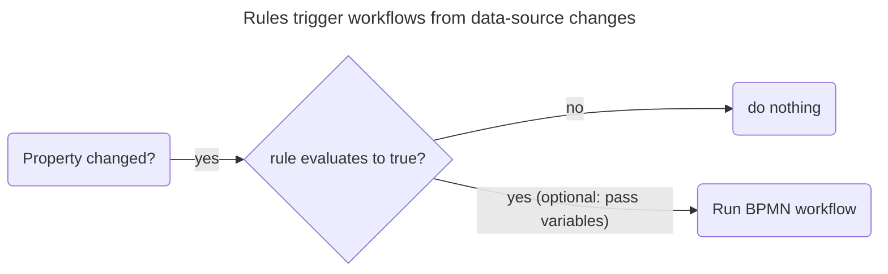

An equipment class rule [triggers a BPMN]() workflow whenever a data source publishes a value that meets a specified threshold.

Imagine a scenario when an oven must be preheated every time a new order number is published to an MQTT edge device.
You could automate this workflow with a rule that listens to messages published and evaluates a condition.
If the condition evaluates to `true`, the rule triggers a  workflow to preheat the oven.




The broad procedure to create a rule is as follows:
1. In the Rhize UI or through GraphQL, create models for the data source and its associated unit of measure, equipment, and equipment class.
1. In the Rhize UI, write a BPMN workflow that is triggered when this data source changes and executes some business logic.
1. In the equipment class, create a rule that triggers the workflow.

The following sections describe how to do these steps in more detail.


{}

This tutorial assumes a data source that exchanges messages over the MQTT protocol.

{}

## Prerequisites

Before you start, ensure you have the following:
- Access your Rhize customer environment
- The [Agent configured]() to listen for your data-source ID

## Set up: configure equipment and workflows

The setup involves modeling the objects associated with the rule.
- Data source
- Data source topic
- Unit of measure
- BPMN
- Equipment class with bound properties

Once you have these, you can create a rule and associate it with an actual equipment item.

### Create a data source

1. From the main menu, navigate to **Master Data > Data Sources**.
2. Create a new data source. The label (ID) must match the one specified in the configuration file for the `libre-agent` microservice.
3. From the **General** tab, add a draft data source version.
4. Select `MQTT` as the data-source protocol.
5. Optionally, enter a connection string, such as `mqtt://<REMOTE_HOST>:1883`, that matches the one specified in the configuration file for the `libre-agent` microservice.
6. Save the data source version to create it.



### Create a data source topic

1. Navigate to the **Topics** tab.
2. Add a new property (that is, a topic).
3. Select `STRING` for the property data type (this assumes an order number is a string such as `Order1`).
4. Select your preferred deduplication key. The default option, `Message Value`, is most appropriate for this scenario.
5. For label, enter the exact topic name as it appears in the data source. Use a slash to access nested topics. For this example, all new order numbers are published to `Oven/OrderNumber`.
6. Confirm by clicking the green tick icon.
7. Navigate to the **General** tab and change the version state to active.



### Create a unit of measure

1. From the Main Menu, navigate to **Master Data > Units of Measure**.
2. Add a new unit of measure.
3. Enter `Order Number` for the unit name.
4. Select `STRING` for the data type.



### Creating a BPMN workflow

A rule must trigger a BPMN workflow.
Before setting up a rule, create its workflow.
For this example, this 3-node BPMN is enough:


1. Navigate to **Workflows > Process List**.
2. Import the BPMN.
3. Save it.
4. Set the version as active.



The BPMN has a `Libre Jsonata Transform` task that contains an expression `"Preheating oven for order number " & $.orderNumber"` .
The rule engine triggers this BPMN with a payload that includes the order number value, as follows:

```json
{
  "orderNumber": "Order1"
}
```

### Create an equipment class with bound properties

#### Equipment class and version

1. Navigate to **Master Data > Equipment Class**.
2. Create a new equipment class from the sidebar. The label might be `Pizza Line`, for example.
3. From the **General** tab, **Create** a new Draft version.



#### Equipment class property

1. From the properties tab, create a new property.
1. For type, select `BOUND`.
1. For name, enter `orderNumber`.
1. For UoM, select the unit of measure created earlier (`Order Number`).
1. Confirm by clicking the green tick icon.



## Create a rule

### Add a rule to an existing equipment class

1. From the Rules tab of an equipment class version, create a new rule.
1. Enter `Run BPMN on Order Number` for the name and confirm.
1. Select `rules_example_bpmn` for the workflow specification.
1. Add `orderNumber` as a trigger property.
1. Add a trigger expression that evaluates to true or false.

{}

The rule runs the preceding workflow only if the expression evaluates to `true`.
It’s common to compare the new value with the previous.

{}

In this case, we can compare the new order number to the previous by adding `OrderNumber.current.value != OrderNumber.previous.value`.
Note that the root of the object path must match the ID of the equipment class property we set up earlier and all evaluations are case-sensitive.

The entire information that becomes available to the rule engine looks like this:

{}
{}

```javascript
{
  orderNumber: {
    current: {
      bindingType: "BOUND",
      description: "bound prop",
      equipmentClassProperty: {
        id: "EQCLASS1.10.orderNumber",
        iid: "0x2a78",
        label: "orderNumber"
      },
      equipmentVersion: {
        equipment: {
          id: "EQ1",
          iid: "0x1b",
          label: "EQ1"
        },
        id: "EQ1",
        iid: "0x22",
        version: "2"
      },
      id: "EQCLASS1.10.orderNumber",
      label: "orderNumber",
      messageKey: "ns=3;i=1003.1695170450000000000",
      propertyType: "DefaultType",
      serverPicoseconds: 0,
      serverTimestamp: "2023-09-20T00:40:50.028Z",
      sourcePicoseconds: 0,
      sourceTimestamp: "2023-09-20T00:40:50Z",
      value: "Order2",
      valueUnitOfMeasure: {
        dataType: "FLOAT",
        id: "FLOAT",
        iid: "0x28"
      }
    },
    previous: {
      bindingType: "BOUND",
      description: "bound prop",
      equipmentClassProperty: {
        id: "EQCLASS1.10.orderNumber",
        iid: "0x2a78",
        label: "orderNumber"
      },
      equipmentVersion: {
        equipment: {
          id: "EQ1",
          iid: "0x1b",
          label: "EQ1"
        },
        id: "EQ1",
        iid: "0x22",
        version: "2"
      },
      id: "EQCLASS1.10.orderNumber",
      label: "orderNumber",
      messageKey: "ns=3;i=1003.1695170440000000000",
      propertyType: "DefaultType",
      serverPicoseconds: 0,
      serverTimestamp: "2023-09-20T00:40:40.003Z",
      sourcePicoseconds: 0,
      sourceTimestamp: "2023-09-20T00:40:40Z",
      value: "Order1",
      valueUnitOfMeasure: {
        dataType: "FLOAT",
        id: "FLOAT",
        iid: "0x28"
      }
    }
  }
}
```
{}
{}
```javascript
`OrderNumber.current.value != OrderNumber.previous.value`
```
{}

{}
```
True
```

The expression evaluates to `false`, because the `current` and `previous` values differ.

{}
{}

Optionally, pass information to the BPMN by adding a payload message. The message is an object with multiple keys.
1. Enter `orderNumber` for the field name.
1. Enter `orderNumber.current.value` for the JSON expression.
1. Confirm by clicking the green tick icon.
1. **Create**.
1. From the **General** tab, change the equipment class version state to active.



### Associate an equipment with a bound property

The final steps to setting up a rule are to:

1. Create a new equipment version.
2. Link it to a data source.
3. Set up bound properties.

#### Create an equipment and version

1. From the Main Menu, navigate to **Master Data > Equipment**.
2. Select a piece of equipment. If none, create one called `Line 1`.
3. From the **General** tab, **Create**.
4. Link the version to the equipment class you created earlier (`Pizza Line`).
5. Save the version to create it.



#### Link a data source

1. From the **Data Sources** tab, link the equipment version to the data source you created in the previous section.



#### Set up the bound property

1. From the **Properties** tab, find a property that you want this equipment to inherit and select the binding icon.
2. If you chose the property `orderNumber`, add the topic `Oven/OrderNumber` you added previously.



## Test the binding and the rule

Send a message to test that the value of the property `orderNumber` of the equipment `Line 1` is bound to the topic `Oven/OrderNumber`.

### Test using an MQTT client

For example, using MQTT Explorer:

1. Open MQTT Explorer and connect to the broker.

The microservice Libre Agent (`libre-agent`) should immediately publish a message to indicate the data source topic `Oven/OrderNumber` has been set up successfully.



2. Publish the string `Order1` to the topic `Oven/OrderNumber`.




If the message has been received,
a new topic, `Oven`, appears with its subtopic `OrderNumber`.

If there is an equipment property bound to this topic,
a topic called `MQTT/<DATA_SOURCE_NAME>/ValueChanged` also appears.
In addition, the published value should show in the column `Expression` of the equipment property `orderNumber`.



{}

If this is the first message published to the topic, the rule will not be triggered because Rhize has no previous value to compare it the message value to. However, if you publish another order number, a new topic called `Core` will show up containing a subtopic called `RuleTriggered` to indicate that the rule has indeed been triggered.

{}



### Confirm in execution in Tempo

To confirm the intended BPMN was executed, navigate to Grafana (Tempo) and look for a trace containing the expected BPMN ID.




## Video example

- :movie_camera: [Trigger BPMN]( https://www.youtube.com/watch?v=y5lr9JRmxDA). This video provides an example of creating a rule based on values for an OPC UA server in a baking process.
