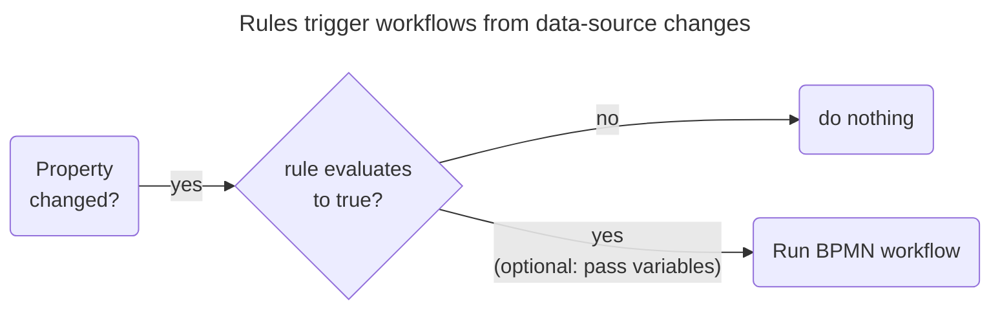

A   can emit a high volume of data,
but not all this data is useful.
To filter for significant events, use the _rules engine_ to write rules to that trigger workflows when conditions are met.

The rules engine evaluates incoming values from a data source and converts significant changes into _events_ to be processed by a  workflow.
Each rule exists on the level of the .
Each rule evaluates changes that happen to a set of specified properties for a data source.
If the condition evaluates to `true`, the engine throws a trigger to start a workflow.
You can also use the message payload to create variables for the workflow to use.

## Steps to create a rule

The procedure is as follows:
1. In the Rhize UI or through GraphQL, create models for the data source and its associated unit of measure, equipment, and equipment class.
1. In the Rhize UI, write a BPMN workflow that is triggered when this data source changes and executes some business logic.
1. In the equipment class, create a rule that triggers the workflow.

### Prerequisites

To create a rule, you must first create the models and workflows that you want to associate with this rule.
The procedure is as follows:
1. [Create models]() for the following associated objects:
    - A []() with topics to subscribe to
    - [Units of measure]() for the values from this data source
    - An []() item that binds properties from the data source
    - An []() that this equipment belongs to
1. [Write a BPMN workflow]() that the rule triggers. You can edit or change this workflow later.

Once you you've created these objects, you can create a rule for the equipment class, as documented in the following section.

### Create a rule in the UI

In the Rhize UI, select the equipment class that you want to create a rule for.
Then follow these steps:

1. In the Equipment class, select the **Rules** tab.
1. In **Workflow specification**, select the BPMN workflow that will orchestrate processes based on the event.
1. In **Trigger properties**, add the data-source properties you want to build the rule on. If any of these properties change, the rule will evaluate them.
1. In **JSONata expression**, enter the JSONata expression that the rule evaluates. For help building expressions, select the **#** button to open the JSONata editor.
1. If needed, use the **Message payload** group to pass values from the message payload into the BPMN . Enter the **Field name**, then write a JSONata expression to filter and transform it.
1. Change the version state to `ACTIVE`.
1. Enable the rule with the toggle.

Here is an example of how a rule might look:



This rule, `High Speed`, triggers the workflow `PizzaLineNewOrder`.
Whenever the `speed` property of the message has a `current.value` that exceeds `100`,
Rhize starts the workflow, passing the value of `speed.current.value` into the BPMN's .

### Confirm success

Once you've created the models, workflow, and rule, confirm that the inputs result in the expected outputs.
The inputs are values from the bound data source properties, and the outputs are what are triggered in the BPMN workflow.
These outputs might be writes to a database, or messages sent to a broker.

## Examples

- :movie_camera:[Trigger BPMN]( https://www.youtube.com/watch?v=y5lr9JRmxDA). This video provides an example of creating a rule based on values for an OPC UA server in a baking process.

