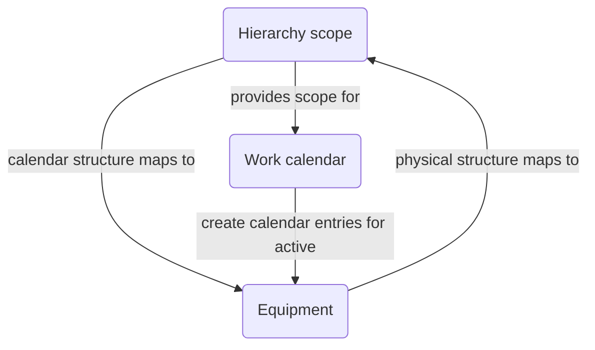

Work calendars represent planned periods of time in your operation,
including shifts, planned shutdowns, or recurring stops for maintenance.
The Rhize API represents calendars through a `workCalendar` entity and this calendar's associated definitions and entries.
They provide helpful abstractions for activities such as scheduling and performance analysis.

Rhize has an optional `calendar` service that periodically queries the Rhize DB for `workCalendarDefinitions`.
If it finds active definitions and equipment for that period, the service creates work calendar entries and persists the data to a time-series database.
This topic explains how that calendar service works.


Rhize's implementation of work calendars was inspired by ISO/TR
22400-10, a standard on KPIs in operations management. 

 
## What the service does



The calendar service queries all active work calendar definitions at an interval designated in your [service configuration]().
The service then checks for any active `workCalendarDefinitionEntry` items that start or end within that interval.
If any exist, Rhize creates a `workCalendarEntry` with the start and end time.

The service then traverses all the calendar `hierarchyScope` entities (designated by the prefix `WorkCalendar`) and their `equipmentHierarchy` properties.
Rhize checks each equipment item for any `workCalendarEntries`.
If the scope includes active equipment, Rhize persists the entry to a time-series database.

### The relationship between hierarchy scope, equipment, and calendars

As the behavior in the previous section describes, the work calendar service coordinates data between 
three entities in your knowledge graph: , , and .
These entities work together to configure work calendars and automate changes of equipment state.

- **Equipment** provides the physical hierarchy of the plant's equipment, at levels that can be as small as a `workUnit` or as broad as the entire enterprise.
- **Hierarchy scope** creates a calendar hierarchy that the equipment hierarchy maps to.
- **Work calendars** and their associated definitions and entries have a hierarchy scope property, which Rhize uses to determine what the equipment state is.

The Rhize service uses the hierarchy scope to establish calendar precedence.
Then, it uses scope's associated calendar states to automatically set the state of the equipment for each hierarchy.
So, when you [create a calendar](), ensure that you configure these three objects.
  
  

### Calendar states

The Rhize database and service has three calendar types:

- `PlannedDowntime`
- `PlannedShutdown`
- `None`, for events that are not considered in OEE calculations.

## Calendar precedence

You can use calendar entries to set different calendar states at different levels of a hierarchy.
It is also possible for multiple shutdown periods to overlap in the same scope.
If an equipment belongs to multiple scopes, the service needs a way to handle this ambiguity.

To prevent conflicts in these situations, Rhize has logic to determine _calendar precedence_.

### The lowest hierarchy scope has precedence

The lowest level of the hierarchy scope defines the calendar state for the equipment in this hierarchy.
For example, imagine two scopes:
- `Scope A` corresponds to an equipment line.
- `Scope B`, the child of `Scope A`, corresponds to equipment items in the line.

If `Scope A` has planned downtime and `Scope B` does not. Then all the equipment in `Scope B` takes state defined by its associated work calendar entries. As `Scope B` is at a lower level, it has precedence.

<!---


 -->

### The first start time, the last end time

It might occur that multiple active work calendars overlap with the same state.
For example, consider three scopes at the same hierarchy level.
- `Scope A` has a planned downtime starting at 00:00 and ending at 12:00,
- `Scope A2` has a planned downtime that starts at 01:00 and ends at 13:00.
- `Scope A3` has a planned busy time that starts at 05:00 and ends at 06:00.

If an equipment item belonged to all these scopes, Rhize would calculate its planned downtime as being from 00:00 to 13:00.
The planned busy time is locked out, since another active entry type has already taken effect.
For a technical overview of how this locking and unlocking of states works, read about the [Semaphore pattern](https://en.wikipedia.org/wiki/Semaphore_(programming)) in computer science.

