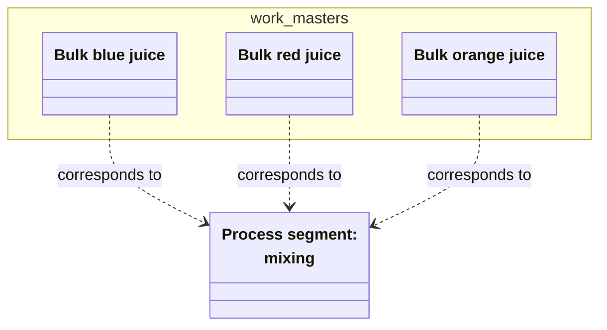
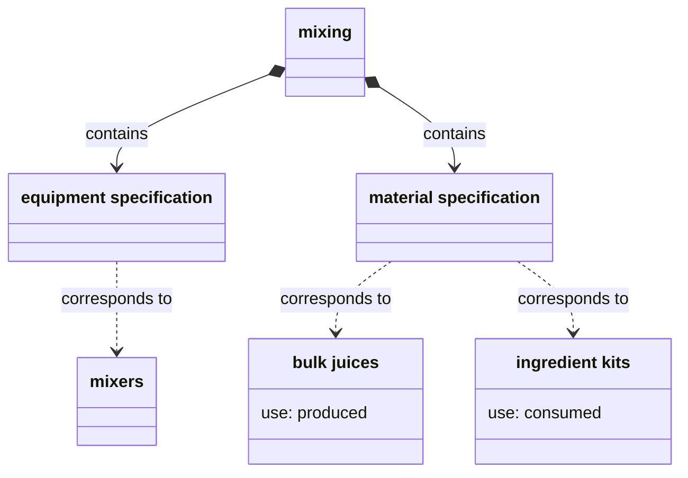
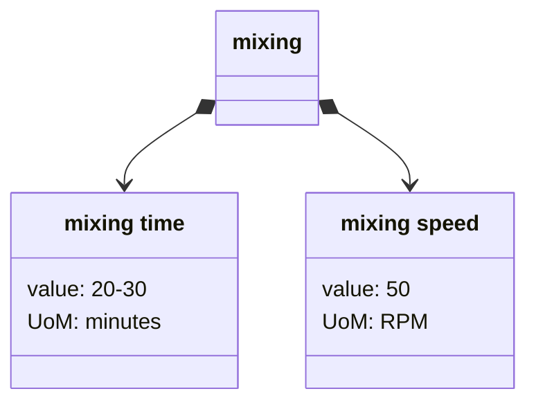
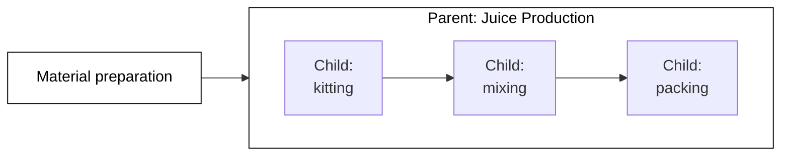
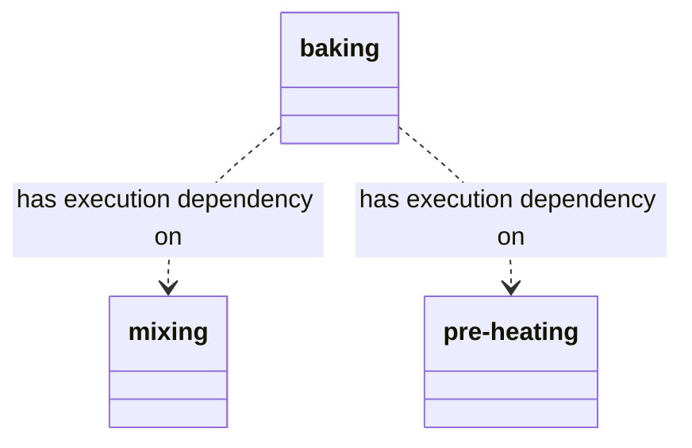

A _process segment_ is a step in a process. 
Process segments are high-level information objects,
abstract enough to be shared by multiple procedures,
and coarse-grained enough to be appropriate for the business perspective of the operation.

A process segment's scope is generally broader than the production of a particular product or .
For example, The Juice Factory produces 5 brands of juice.
While the particular material consumed and produced differs in the production of each brand,
all brands still follow the steps of `material receiving`, `kitting`, `mixing`, and `packing`.
These steps are process segments.

## Reasons to use segments

Process segments can serve operational and analytical functions.
- From the operational side, a segment provides a way to avoid repetition when modeling steps that are common to different processes. 
- From the analytical side, a process segment provides a way to compare different procedures that are all derived from a common procedure or to view similar steps in a single aggregation.

## Segments vs. equipment hierarchies

Process segments are not necessarily connected to the [role-based equipment hierarchy]().
Since a defining aspect of equipment in ISA-95 is that it plays a precise role,
you might wonder whether a process segment is just a needless duplication:
why add a `mixing` segment when the `mixers` equipment model serves same role?

However, the fact that process segments are decoupled from equipment can help you model a variety of conditions:
- Some steps have no equipment requirements. For example, the `kitting` process segment in the juice factory requires no equipment, but it is a necessary part of the production process.
- Some steps may be common to a number of processes, but each particular process may require a different set of equipment. 

## Segment relationships

Process segments have relationships to a number of other work and resource models.

### Corresponds to

Unlike process segments,
operations segments and work masters might describe the steps to create a particular product.
So, these models can _correspond_ to a process segment:
- From the business-perspective, product steps are modeled in _operations segments_.
- From the more granular MES perspective, product steps are modeled in _work masters_.

For example, the Juice Factory has various work masters to produce material definitions for different bulk juices: `Bulk blue juice`, `Bulk orange juice`, and so on. 
Each of these work masters correspond to the same process segment, `mixing`.

### Contains specifications

A process segment may contain one or more resource _specifications_.
These specifications describe the necessary resources for the step.

### Contains segment parameters

A process segment can _contain_ process segment parameters.
Process segment parameters store additional information about the step.
For example, the `mixing` process segment might have a `mixing time` parameter.

The parameter also can have a value or range of values.
This process segment parameter value may serve as a default for lower-level work models.

### Is made of

A process segment can _be made of_ of other process segments.
You can use this relationship to model sub-steps.

For example, The Juice Factory might need to distinguish preparation steps from production steps.
A parent segment provides a model to aggregate the production steps in one parent process segment.

### Dependency

In some instances, you might need to strictly model the order in which some or all steps happen.
For this, use _segment dependancies_.

Segment dependencies become more important where steps might execute in parallel or dynamically.
The dependency ensures nothing happens too early.

