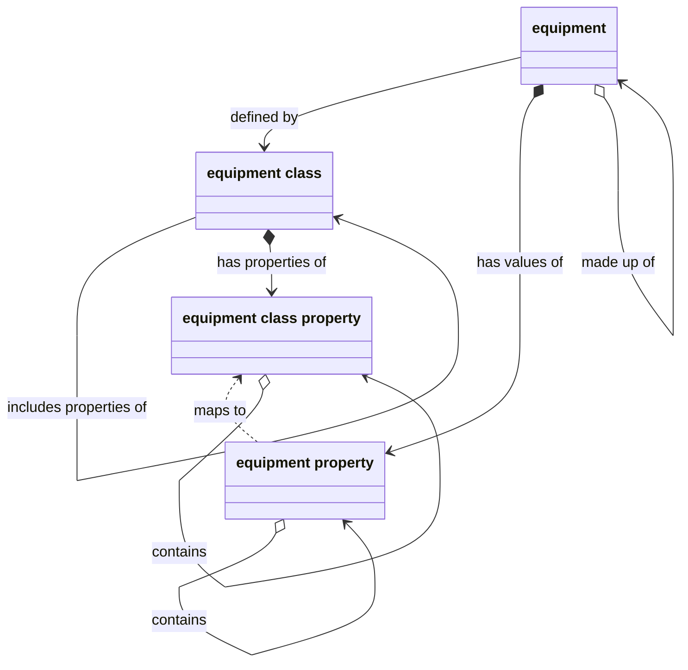
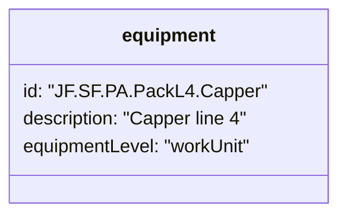
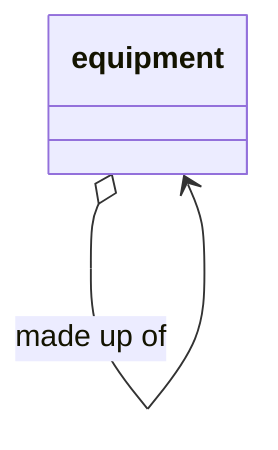
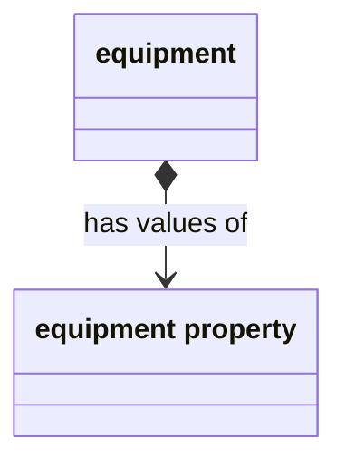
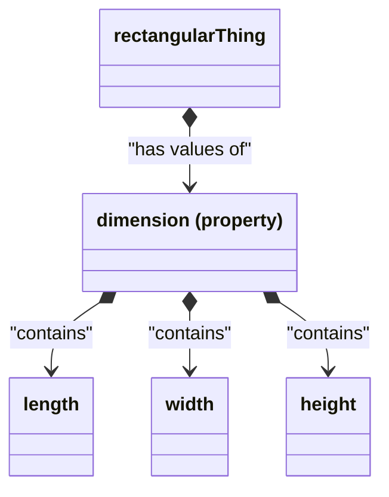
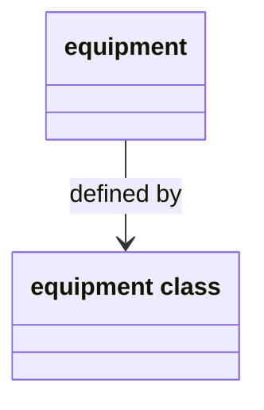
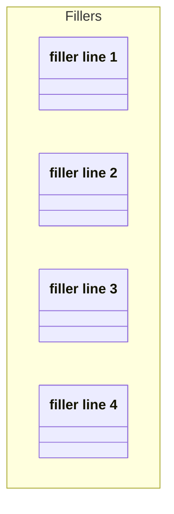
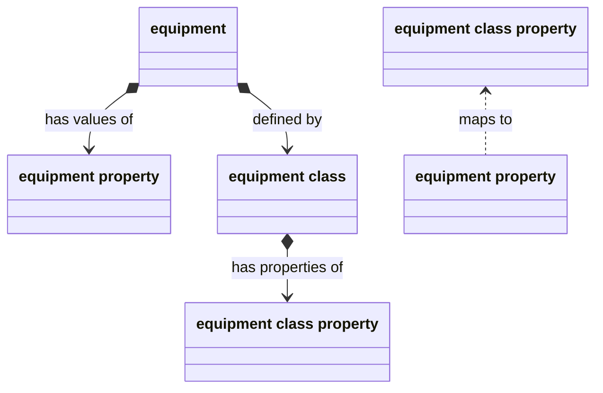
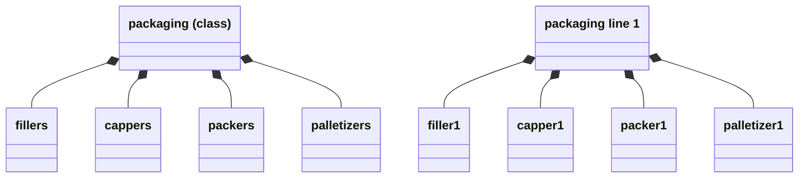

{}

Equipment is an object that has a defined role in the production process. 
Equipment can have _properties_, which define some temporary or permanent value,
and can belong to _classes_, which provide templates to define and categorize related objects.



All the equipment entities are connected through relationships.
This page describes what these relationships are and when to use them.









## The role-based hierarchy


The word _role_ is key to understanding the ISA-95 equipment models.
All equipment has a particular function in the wider operation.
The scope of a role varies widely, from the execution of an enterprise-level schedule to the production of a single unit of material.

Equipment with broader scopes occupy higher _levels_,
and they may be composed of lower-level equipment objects that perform more specialized roles.
This composition of equipment is called
the _role-based equipment hierarchy_.



Your model can be explicit about the equipment's position in the hierarchy through the `equipmentLevel` attribute.



Note that the lowest two levels distinguish equipment that has a storage role from equipment that has a production role.

When equipment has a production role, that role typically is scoped to the execution of an order or collection of orders.
For example, in our fictional juice factory, equipment roles include:
- The Springfield plant. A site-level equipment that organizes the production of all brands of juice.
- The sugar storage zone. Where the Springfield site stores raw sugar in silos.
- The mixing unit. a work unit that receives raw coloring, flavoring, and sugar as input and produces a bulk volume of `Cosmic Blue juice` material as output.


The role of work units, equipment on the lowest level, is typically to execute one order at a time. 
For that reason, PLCs and other controls-level equipment is typically below the scope of the ISA-95 equipment model
&mdash;though **the model may provide an interface for PLC to level-3 interaction.**


## Equipment is made up of equipment
 
Equipment is made up of other equipment.
High-level equipment items are composed of equipment items with more granular functions.
For example, the juice factory has a work center, `packaging line 1`, that is composed of 4 lower level units that perform specific packaging functions.



### Reasons to use `isMadeOf`

The `isMadeOf` relationship provides a way to organize equipment in its hierarchical structure.
This structure often mimics the spatial hierarchy of the plant or the social hierarchy of the organization.

Besides this, the `isMadeOf` relationship provides a way to do the following:
- **Set required assemblies for sub items**. For example, a process specifies a `Sweeteners storage center` it also logically specifies the equipment that that storage center contains (e.g. `silos`)
- **Query and compare work by zone of interest.** For example, you could compare performance across all packing lines by querying the parent center. 
- **Provide a view of the manufacturing operation that is intelligible from the business perspective.**
The equipment model focuses on the production of new material, not individual controls.  

### Query example: full composition of The Juice Factory


In the RhizeDB, the equipment `isMadeUpOf` relationship can be queried as follows.
This response shows the entire equipment hierarchy for The Juice Factory enterprise.


{}
{}

```gql
query enterprise{   
  enterprise: getEquipment(id:"JF.SF") {
    ...active
     isMadeUpOf {
      ...active    
      isMadeUpOf {
        ...active
        isMadeUpOf {
          ...active
          isMadeUpOf {
            ...active
            isMadeUpOf {
              ...active
            }
          }
        } 
      }
    }    
  }
}

fragment active on Equipment{
   activeVersion {
      id
      description
      equipmentLevel
   }
}
```

{}
{}
```json
{}
```

{}
{}




## Equipment can have properties

Properties are _key value_ pairs that report some permanent or temporary condition of an object.
Equipment can have 0 or many properties.



For example, the `Packaging line` work center has the properties:
- `State`, which reports whether the center is active or not.
- `infeed`, the number of empty containers at the beginning of the line
- `outfeed`, the number of filled containers at the end of the line

The value of these properties can used to calculate metrics or trigger workflows.

### Equipment properties can contain properties

A property itself can have a composition of properties.
For example, a unit might have the `dimension` property that contains subproperties of `width` and `height`.




This `contains` relationship creates a container to group granular properties by some commonality. 
It also saves configuration time, since any equipment that has the parent property can logically have its child properties as well.


## Equipment classes define equipment

Similar equipment might be _defined_ by its equipment class.
Classes minimize repetitive modelling of equal equipment and properties.



For example, the `packing line` work center always has a `filler` work unit as part of its composition.
So, when there are 4 `packing lines`, there logically must be 4 fillers.
To avoid individually tracking each filler and its configuration, you can create a `fillers` class that defines each member.



### Query example: all members of `Packaging` class


This example queries the Rhize DB for all members of the `Packaging` equipment class.





```gql
query equipmentClass{
  getEquipmentClass(id:"Packaging") {
    id
    equipmentVersions {
      id
      description
    }
  }
}

```


```json
{
  "data": {
    "getEquipmentClass": {
      "id": "Packaging",
      "equipmentVersions": [
        {
          "id": "JF.SF.PA.PackL1",
          "description": "Packaging line 1"
        },
        {
          "id": "JF.SF.PA.PackL2",
          "description": "Packaging line 2"
        },
        {
          "id": "JF.SF.PA.PackL3",
          "description": "Packaging line 3"
        },
        {
          "id": "JF.SF.PA.PackL4",
          "description": "Packaging line 4"
        }
      ]
    }
  }
}

```






### Equipment properties map to class properties


As equipment can have equipment properties, an equipment class can have equipment class properties.
However, an equipment class property is only a key, not a value.
When an equipment belongs to an equipment class, that equipment receives its properties.
So, equipment properties _map to_ the class properties.




Classes are abstract, and so class properties are abstract keys.
An Equipment is tangible, and thus has a property key and an actual value.


### Equipment classes can be made of other classes

As equipment can be _made of_ equipment, so equipment classes can be made of equipment classes.



