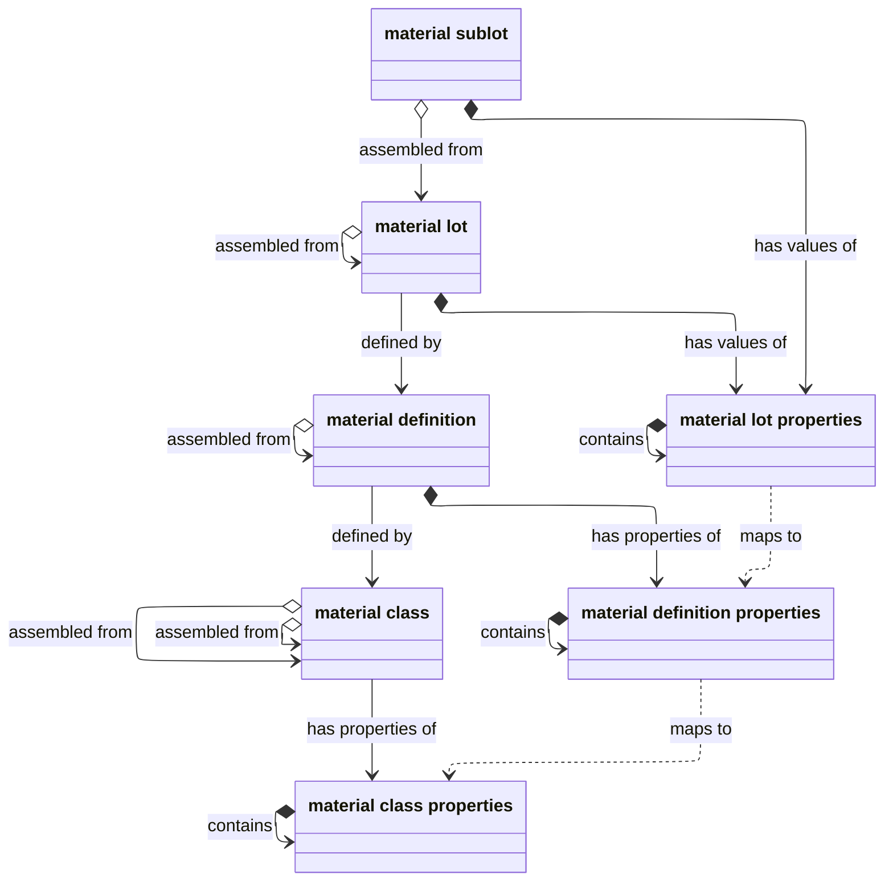
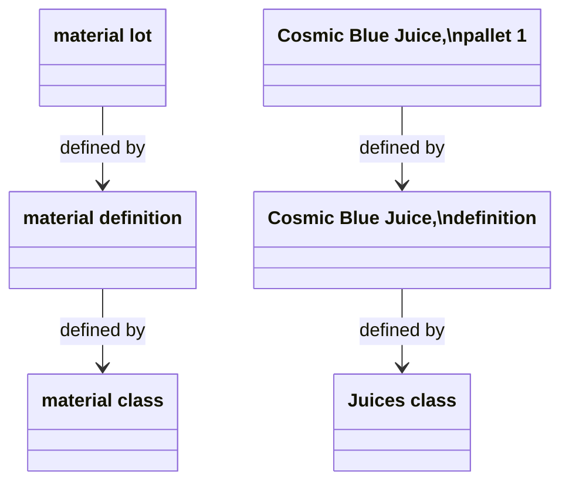
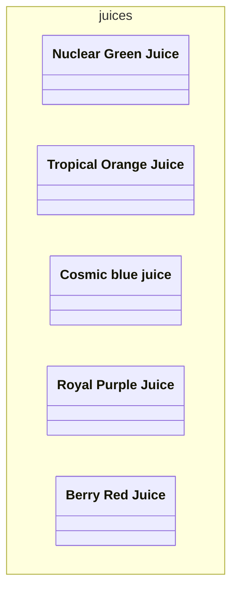
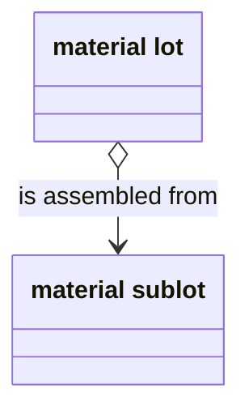
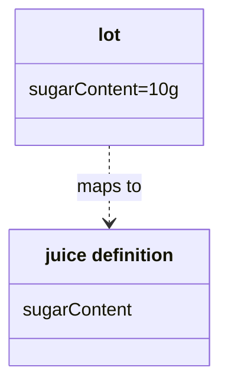
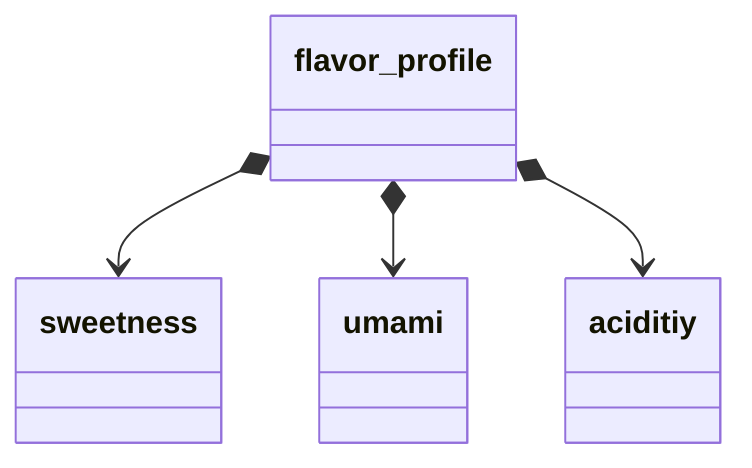

In ISA-95, _material_ can be a finished good or anything that goes into this good.
Examples of material include:
- A final product, such as packaged watch
- A part, such as a gear in this watch 
- An intermediate substance, such as a produced reactant to be used in combination with another chemical
- Raw materials, like the flour and water that make dough


Like [equipment](), material can have classes and properties.
However, to account for detailed tracking of unique material units,
the material model has more entities than equipment.







## Defined by

The `defined by` relationship associates material with common categories and definitions. 



### Material lots are `defined by` material definitions

_Material definitions_ provide a way to ensure units of the same substance 
have a consistent name and set of properties.
_Material lots_ provide a way to uniquely identify each specific instance of that definition.

For example, the Springfield plant might produce 100 pallets of its flagship product, `Cosmic Blue Juice`.
Obviously, these pallets are not literally the same: otherwise they would just be one pallet.
Rather, each pallet is a separate _lots_, and all these lots share the same material definition.


### Definitions are defined by classes

If you need another level of abstraction, you can also categorize your material definitions by _material class_.
Material classes provide a way to categorize material by function or shared [properties]({#material-properties}).
For example, `The Juice Factory` has five juice definitions, all part of the class `Juices`.


Note that material classes can contain material classes. For example, the `raw_materials` class might contain all raw ingredients.

```mermaid
---
subtitle: Material classes can contain material classes
---
classDiagram
namespace raw_materials{
  class sweeteners
  class flavors
  class colors
}
namespace sweeteners{
  class sugar
  class aspertame
}
namespace flavors{
  class `blue flavoring`
  class `orange flavoring`
}
namespace colors{
  class `blue`
  class `orange`
}


```

## Is assembled from

Material lots also might be _assembled from_ material _sublots_.




Sublots are uniquely identifiable components of a material lot.
For example,
the pallet `PBJ.1000.1` might be assembled from a set of packed juice cases.
Each case might be modelled as a sublot with a unique ID, such as `PBJ.1000.1.1`.


## Has values and properties {#material-properties}

Material lots and sublots can have _properties_,
and these properties may have values.
If the property is common across the material definition that defines the lot,
you can model your material properties so that they _map to_
the corresponding _material definition properties_.


  

Class and definition properties are abstract and therefore don't have values.
The lot, on the other hand, is real, so it has a value.
So the `Sweeteners` class, the `Cosmic Blue Juice` definition, and the `PBJ.1000.1` lot all might have a `sugarContent` property, but only the lot can have an actual value for this property, such as `100 grams`.


## Properties contain properties



As with equipment properties, all properties can contain properties.
For example, the property `flavor_profile` might contain properties for `sweetness`, `acidity` and `umami`.
