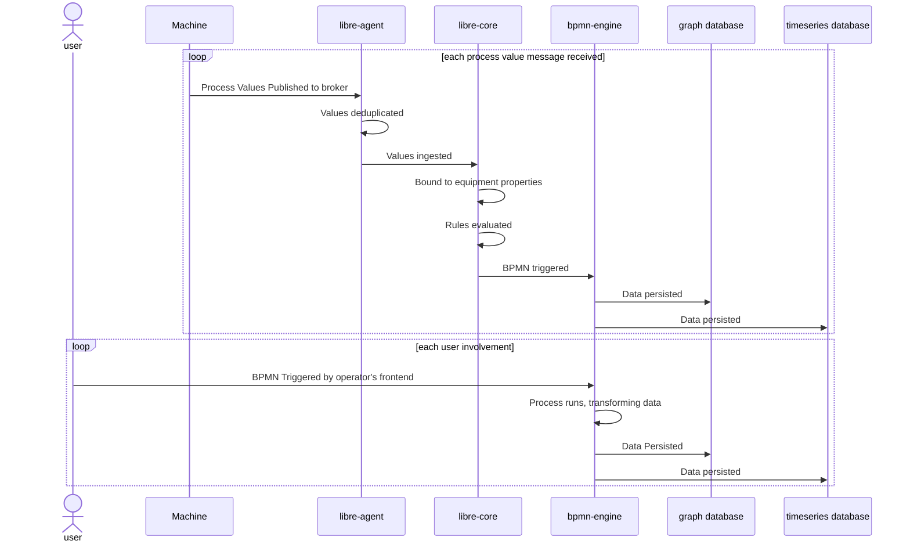
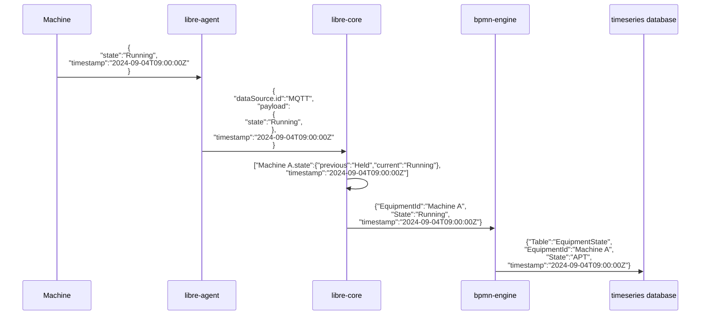
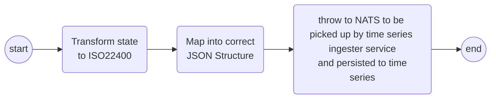
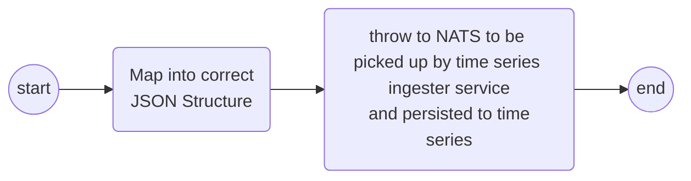
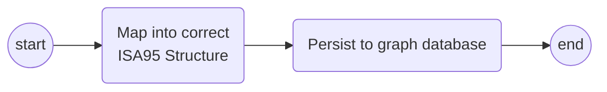
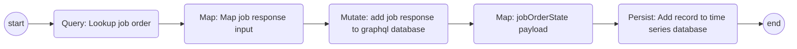
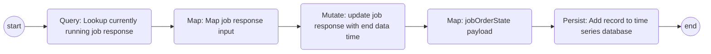
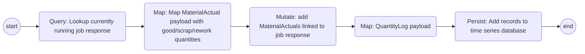

This document provides a high-level overview of how to use Rhize for calculating various KPIs including OEE. It will also detail one end-to-end solution.

## Outline

OEE (Overall Equipment Effectiveness) is a key performance indicator (KPI) that measures how effectively a manufacturing process utilizes its equipment. As defined in ISO 22400, OEE evaluates three primary factors: availability, performance, and quality, helping to determine the ratio of actual output to maximum potential output. It is a standard method for assessing and improving production efficiency in industrial operations.

## ISA95 architecture



## Specific implementation

This implementation tutorial will include many high level concepts including:

- [Using the rules engine to persist process values]()
- [Using messages to trigger BPMN workflows]()
- [Using user-triggered workflows]()

### Pre Requisties

- Rhize installed and configured, including timeseries tools

### Overall system architecture



#### Handling real-time values

For detailed information see: [How To: Create equipment class rule]()

Rhize provides the functionality to ingest telemetry values. The OEE calculation is particularly interested in machine state changes and produced quantities. libre-agent ingests values from an external broker using protocols such as OPCUA, MQTT, Kafka.

Data Flow Diagram:



Rhize Architecture:

From the diagrams above, a machine will publish telemetry values to an MQTT server in the form

```json
{
  "state": "Running|Held|Stopped",
  "quantityCounter": 10 
}
```

These values are processed by libre-core and the rules engine which can be configured to:

- Trigger a BPMN workflow when the machine state changes to persist the value to timeseries

```pseudocode
Trigger Property: State
Trigger Expression: State.current.value != State.previous.value
BPMN Variables:
  State: State.Current.value
  Timestamp: SourceTimestamp
  EquipmentId: EquipmentId
Workflow: RULE_Handle_StateChange
```

- Trigger a BPMN workflow when the produced quantity value changes to perist the value to timeseries

```pseudocode
TriggerProperty: QuantityCounter
TriggerExpression QuantityCounter.current.Value != QuantityCounter.previous.Value
BPMN Variables:
  QuantityDelta: State.current.value - State.previous.value
  Timestamp: SourceTimestamp
  EquipmentId: EquipmentId
Workflow: RULE_Handle_QuantityChange
```

Workflows:

RULE_Handle_StateChange



RULE_Handle_QuantityChange



#### Order import

In this scenario a production order is published to the mqtt server and libre-agent is used to bridge the message into nats.

The production order contains information such as operations, materials produced and consumed and any particular equipment requirements. It will also include the planned rate of production for each operation which will be added as a job order parameter. The import workflow will listen for the order to be published to nats, map the data into ISA95 entities and perist to the graph database.

Workflow NATS_ImportOrder:



#### User orchestrated workflows

An operator has the responsibility of starting/ending operations as well as recording the good/scrap produced quantities. These values need to be persisted to the time series database (see TODO:Link and TODO:Link). These workflows will be triggered by an API call from the operations front end.

Workflows:

API_StartOperation



API_EndOperation



API_RecordProducedQuantities



#### Dashboarding KPI Queries

Using the KPI Queries we can create Grafana dashboards which may look as follows:


