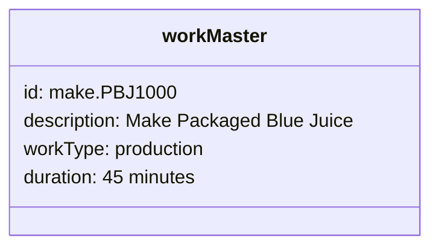
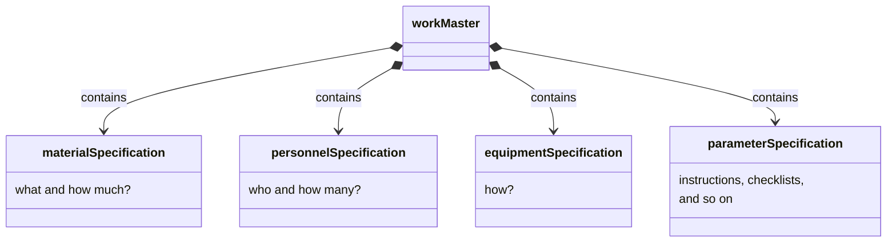
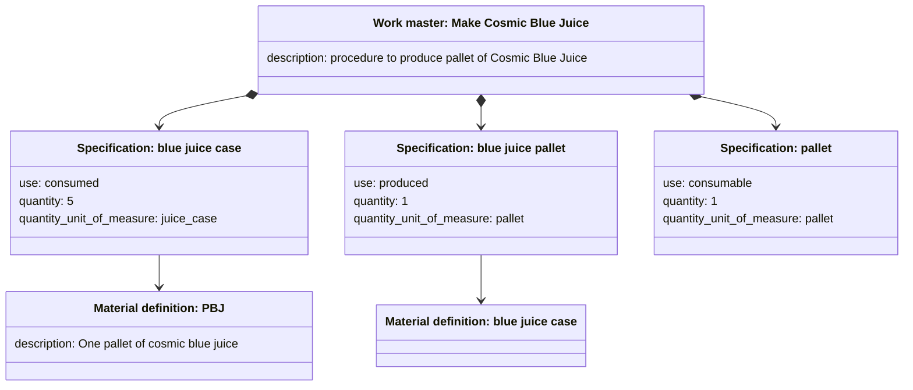
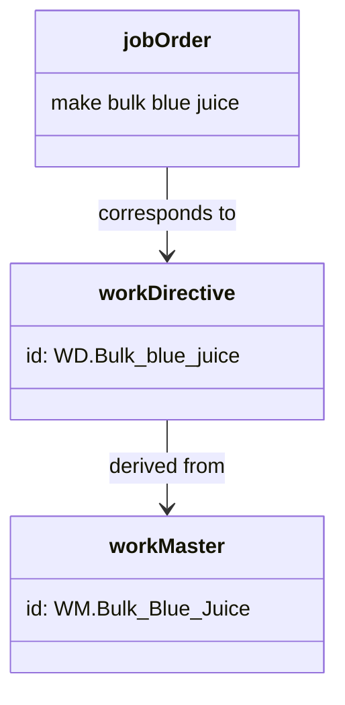
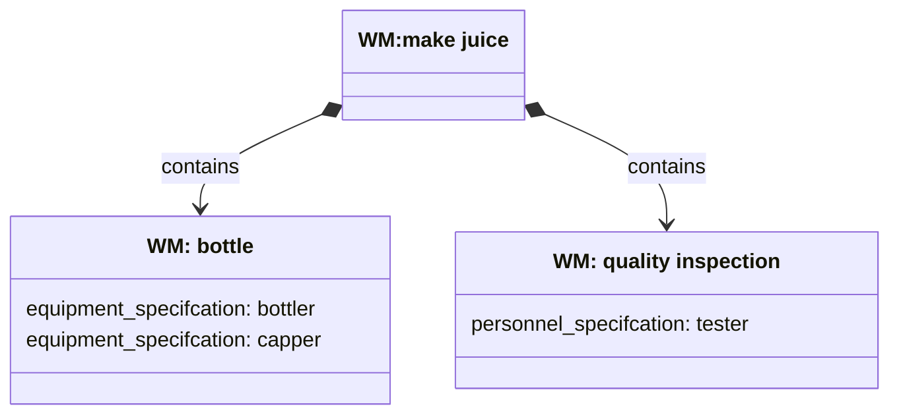
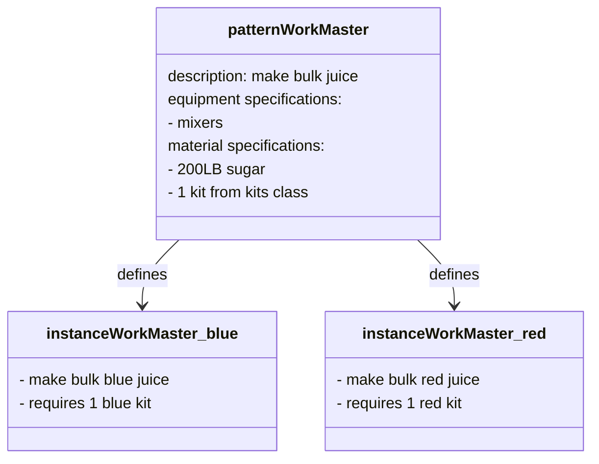
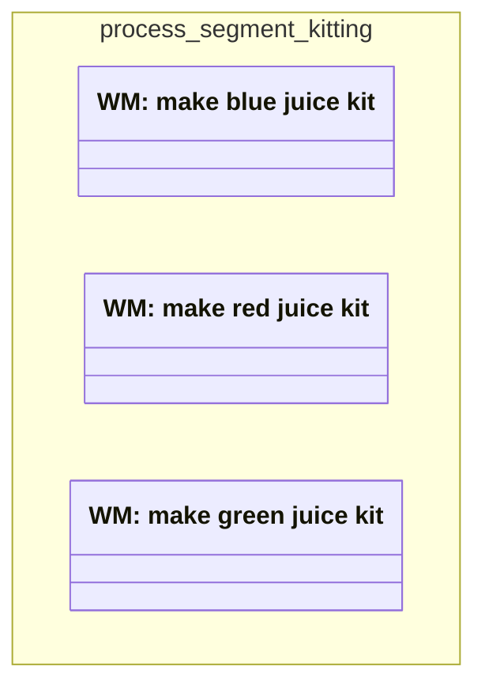

A _work master_ defines the resources and instructions necessary to do a unit of work.
As the most granular work definition in ISA-95, the work master can serve a variety of operational purposes:
- Define how to create a product from the perspective of a level-3 system
- Provide a reference document that can be cloned and overridden for detailed scheduling and dispatching
- Store recipes and parameters to be downloaded by the PLC
- Contain parameters to derive metrics for KPI calculations

In the manufacturing , the work master has relationships to resources, other work definitions, and planning entities. Like other work definitions, a work master can be either a , defining a template for work, or an , defining a unit of actual work.

## Work master attributes

Along with relationships described in the following sections, work masters have attributes to identify and qualify the type of work being defined.
Important attributes include:

ID
: A unique ID

Work type
: The category of work―one of `production`, `maintenance`, `quality`, or `inventory`

Duration
: The expected time needed to perform the work
 

## Contains resources and parameter specifications {#contains}

A work master may have _specifications_ that link the work master to its required resources and instructions. 
In ISA-95 relations, the specification is an intermediary between the work master and the resource or parameter.
The work master _contains_ the specifications;
the specifications describe the necessary quantities and uses of the resource object that it _corresponds to_.

### Example: material specifications

Resource specifications may have attributes that describe information about the use, quantity, and location of the resource.
Some specifications, such as material, have additional attributes.

For example, to produce one pallet of `Cosmic Blue Juice`, The Juice Factory requires 5 cases of Blue Juice and one pallet.
The work master to produce this final product specifies three different materials, all of which are used in a different way:
- Consume 5 units of the `blue juice case`, a 
- Produce 1 unit of `packed blue juice`, a 
- Use one pallet, a consumable (material that has no )


Note that the preceding diagram includes only the material specification.
The full work master may also contain specifications about the equipment, personnel, parameter specifications, and so on.


### Parameter specifications

Parameter specifications detail information that is specific to a work master but not specific to any particular resource.
For example, the production of bulk juice might have a parameter specification called `pre-mix checklist` that details a set of steps that the operator must perform before starting the equipment.

## Relationships to planning models

As work masters [contain](#contains) resource requirements and instructions, they also act as a source document for detailed scheduling and dispatching.
Conventionally, work masters are related to job orders through a work directive entity:
- The job order says what to make
- The work master provides a canonical definition of how to make it
- The work directive provides a copy of the work master, specific to the particular order

### Corresponds to work directive

A work directive is a clone of the work master that is made at the time of dispatching.
If the actual work performed needs to deviate from the work defined in the work master,
the work directive provides a way to record the changes in a new definition.

For example, the work master to `make bulk blue juice` might specify sugar from a specific provider.
At the time of production, however, the plant might have only sugar from a different supplier.
In this case, the work directive would override the material specification to reflect the substitute material definition.

## Relationships to other work masters

A work master might have relationships to other work masters:
- A work master may _contain_ children work master.
- An  work master may _be defined by_ a __ work master.

### Parent child-work masters {#parent}

You can group sub-definitions of a work master using a parent-child relationship.
For example, the work master to `make juice` might have child work masters for the production recipe from the quality testing procedure.

### Defined by patterns {#pattern}

A _pattern_ work master provides a template to build _instance_ work masters for similar production processes.

For example, to produce bulk juice for all five of its juice lines,
The Juice Factory requires exactly the same equipment and quantity of sugar.
The only item that changes is the material definition for the kits that are dumped into the mixer.

To minimize configuration, The Juice Factory might use a pattern work master that specifies the equipment, sugar, and kit class.
Then each brand of juice may have an instance work master that overrides the `kits` class with its specific kit definition.

### Corresponds to a process segment

Work masters _correspond to_ [process segments](), which are less granular, business-level definitions of work.
For example, the `make juice` process segment might have five corresponding work masters that describe how to produce each line of juice at the level of detail necessary for a manufacturing execution system.

## Workflow specifications

The work master may be linked to other work masters in a sequence through a _workflow specification_.
The workflow specification provides an overview of the steps to execute masters in sequence.

Each master can _have_ a node that exists in the workflow specification.
For example, here are the production steps to make blue juice.
Each node in this workflow might correspond to a work master, with the `pack` node being a  that corresponds to the `pack` [parent](#parent) work master.

