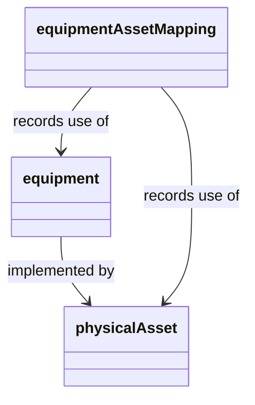

{}

A _physical asset_ is equipment that can be swapped in and out of an [equipment role](/isa-95/resources/equipment#role).
They are primarily used for equipment that can be repaired or replace.

## Relationship to equipment

Physical assets _implement_ equipment roles.
This relationship is tracked through the _equipment asset mapping_ entity.
The equipment asset mapping maintains the relationship between the equipment and the physical assets that have implemented it.

For example, imagine that the Juice Factory may have a `Make Juice` process that requires the equipment `mixer`.
The plant has multiple physical mixers, which are periodically swapped in and out for maintenance.
Through the physical asset, the operations team can track both the history of the specific mixer and the history of the equipment as it plays a role in jobs to make juice.

Except for this, the relationships between physical asset models are identical to the relationships between equipment models.
For example,
physical assets are defined by physical asset classes;
physical asset classes have properties that the physical assets can inherit;
and physical assets can be made up of physical assets.

### Common use cases

Physical assets are used less frequently than the equipment or material models.
However, in some use cases, adding a physical assets can serve operational and analytical needs.
For example:

- When multiple assets perform the same equipment role, adding a physical asset and equipment asset mapping tracks use. This information might be used to plan maintenance or identify deviations in specific machines.
- In scheduling, equipment availability may derive from physical asset availability 
- When an asset can be plugged into many roles, modeling a physical asset provides a way to track the asset's history across its diverse functions.
- Some operations exclude some physical equipment from the role-based equipment hierarchy. For example, a plant may have many processes that use a digital scale.
In this case, the model might track scales only as physical assets and not create a precise role for all the processes that may require a scale.
