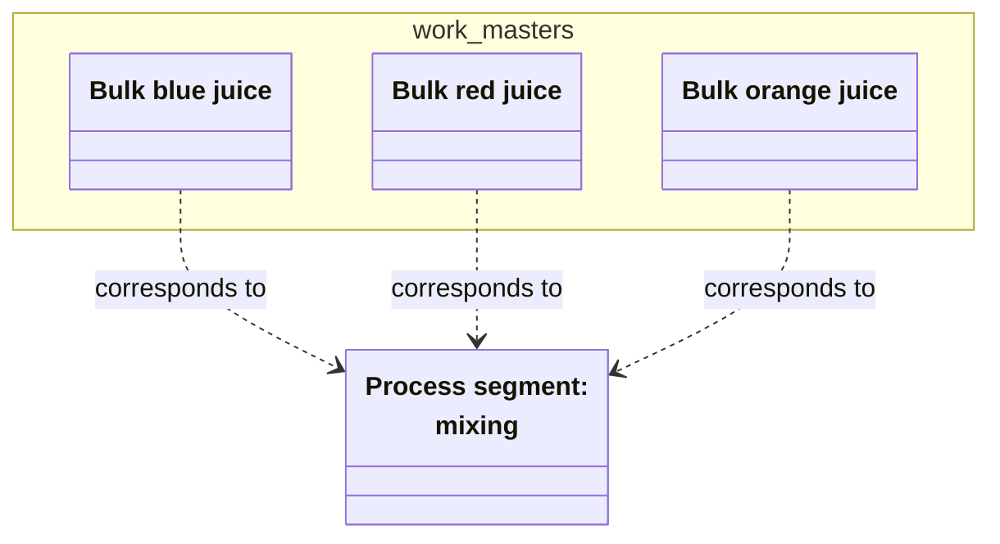
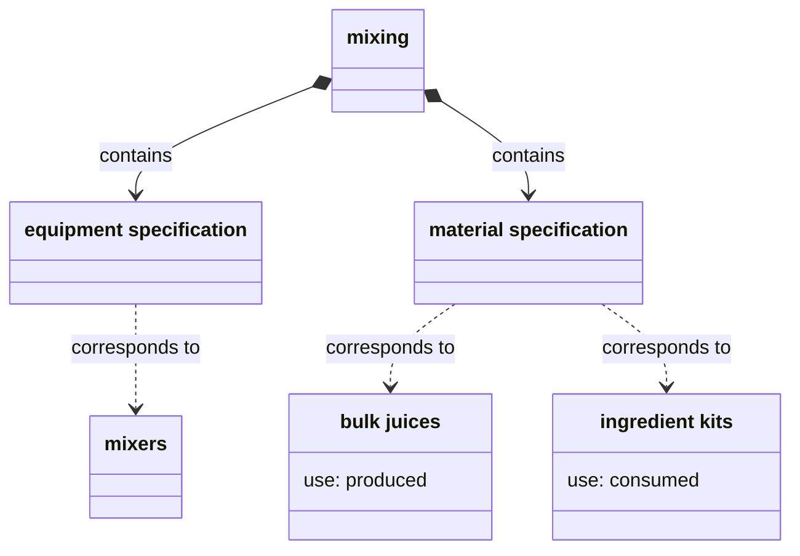
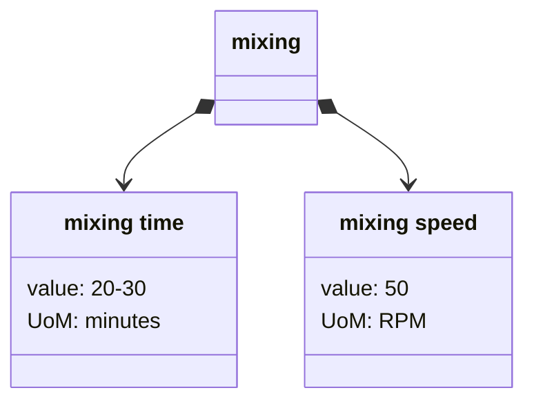
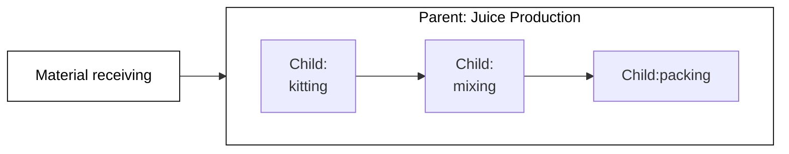
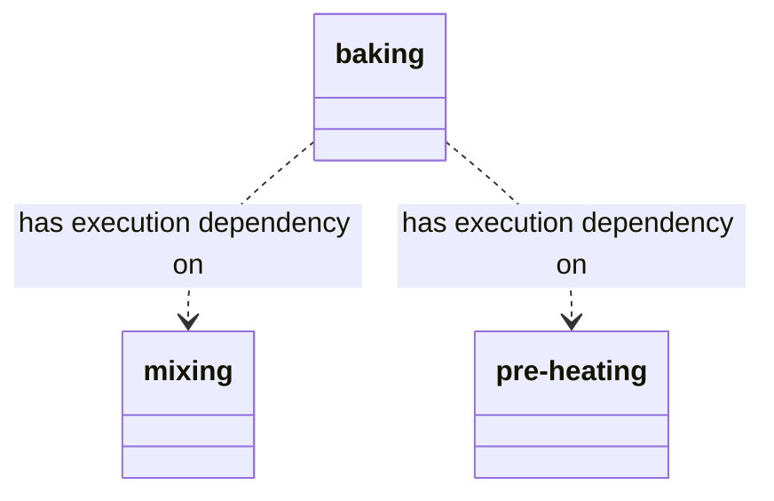

{}

A _process segment_ is a step that can be shared across processes.
Process segments are flexible information objects,
abstract enough to be shared by multiple procedures,
and coarse-grained enough to be appropriate for business planning and analytics.

Process segments provide information that is relevant to both [levels 3 and 4]().
In the manufacturing ontology, the process segment has relationships to diverse other entities, including objects for scheduling, definitions, and work performance.
As such, the proper use of process segments provides much flexibility in how you implement an MOM system for both operational and analytical use cases.



## The scope of a process segment

Process segments can have a [parent-child hierarchy](#is-made-up-of).
At higher levels of this hierarchy, the scope of a process segment is often broader than that of a particular product.

For example, The Juice Factory produces five brands of juice.
While the particular material consumed and produced differs in the production of each brand,
all brands still follow the steps of `material receiving`, `kitting`, `mixing`, and `packing`.
These steps are process segments.

## Reasons to use segments

Process segments can serve operational and analytical functions.
Operational functions include:
- To avoid repetition when modeling steps that are common to different processes. 
- To define work from a business-process perspective. More granular entities might define a route of segments to follow in specific situations. For details, read the example in the [corresponds to](#section).

You can also use process segments in various analytical functions, such as:
- Comparing different product processes that are all derived from a common procedure.
  For example, the mixing segment might [correspond to](#correspond-) to the production of `mixed red juice` and `mixed blue juice`.
- Viewing data and parameters for similar steps in a single aggregation.
  For example, you might compare the average time of all jobs associated with `mixing` against the other segments to find a general process bottleneck.

## Segments vs. equipment hierarchies

Process segments are not necessarily connected to the [role-based equipment hierarchy]().
Since a defining aspect of equipment in ISA-95 is that it plays a precise role,
you might wonder whether a process segment is just a needless duplication:
why add a `mixing` segment when the `mixers` equipment model serves the same role?

However, the fact that process segments are decoupled from equipment can help you model a variety of conditions:
- Some steps have no equipment requirements. For example, in The Juice Factory, the `kitting` process segment requires no equipment.
- Some steps may be common to a number of processes, but each particular process may require a different set of equipment. 

## Segment relationships

Process segments have relationships to a number of other work and resource models.

### Corresponds to

Operations segments and work masters usually describe a step to create a particular product.
These models may _correspond_ to a process segment:
- From the business perspective, product steps are modeled in _operations segments_.
- From the more granular MES perspective, product steps are modeled in _work masters_.

For example, the Juice Factory has various work masters to produce material definitions for different bulk juices: `Bulk blue juice`, `Bulk orange juice`, and so on. 
Each of these work masters correspond to the same process segment, `mixing`.

### Contains specifications

A process segment may contain one or more resource _specifications_.
These specifications describe the necessary resources for the step.

### Contains segment parameters

A process segment can _contain_ process segment parameters.
Process segment parameters store additional information about the step.
For example, the `mixing` process segment might have a `mixing time` parameter.

The parameter also can have a value or range of values.
This process segment parameter value may serve as a default for lower-level work models that [correspond to](#corresponds-to) this process segment.

### Is made of

A process segment can _be made of_ other process segments.
You can use this relationship to model sub-steps.

For example, The Juice Factory might need to distinguish preparation steps from production steps.
A parent segment provides a model to aggregate the production steps in one parent process segment.

### Dependency

In some instances, you might need to strictly model the order in which some or all steps happen.
For this, use _segment dependancies_.

Segment dependencies become more important when steps might be executed in parallel or dynamically.
The dependency ensures nothing happens too early.

If your process segment is independent of a particular product,
ensure that all entities that [correspond to](#correspond-to) that segment also have that dependency.
For example, in a pastry production, the `baking` segment might have a dependency on `mixing` and `preheating`.
This implies that all products that correspond to this `baking`&mdash;such as a `chocolate chip cookies` or `brownies`&mdash;must also require `mixing` and `preheating` as dependencies.

If a dependency is product-dependent, define it on the level of the  or operation definition instead.

